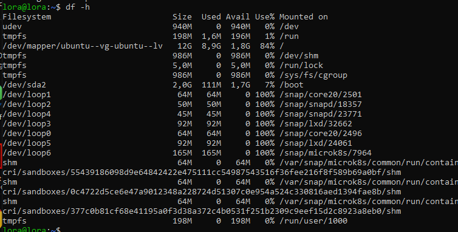
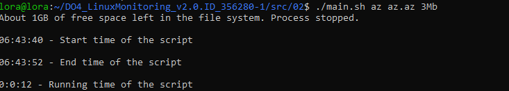
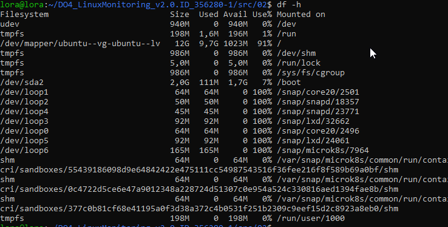
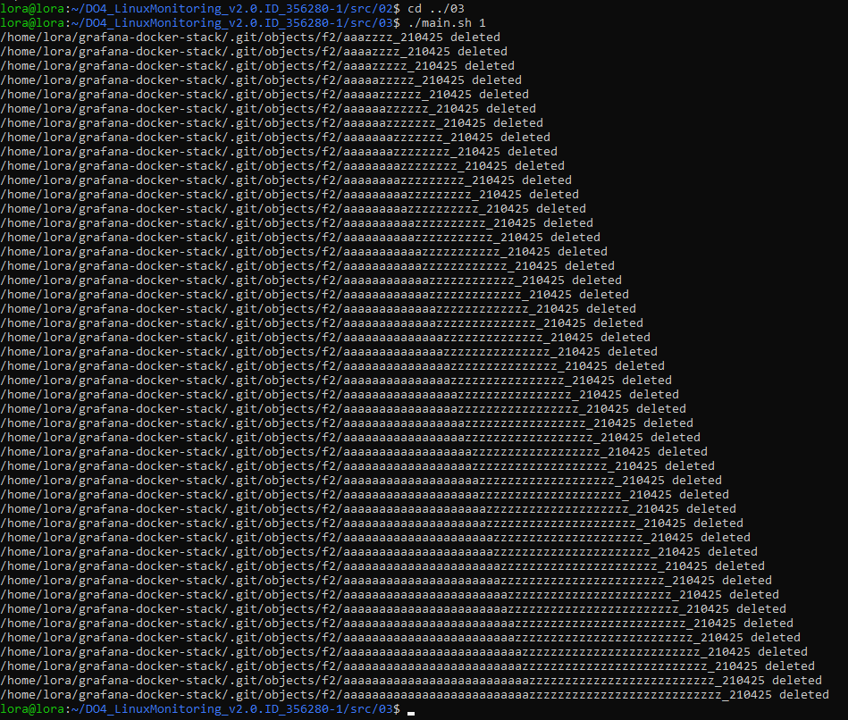
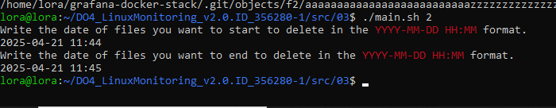
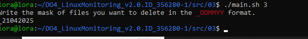
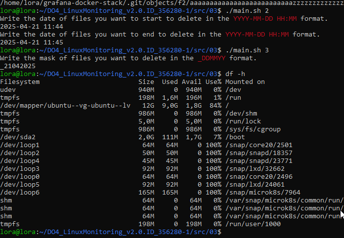

## Part 2. Засорение файловой системы

**== Задание ==**

Напиши bash-скрипт. Скрипт запускается с 3 параметрами. Пример запуска скрипта: \
`main.sh az az.az 3Mb`

**Параметр 1** - список букв английского алфавита, используемый в названии папок (не более 7 знаков). \
**Параметр 2** - список букв английского алфавита, используемый в имени файла и расширении (не более 7 знаков для имени, не более 3 знаков для расширения). \
**Параметр 3** - размер файла (в Мегабайтах, но не более 100).  

Ввожу команду `df -h` перед запускам скрипта засорения файловой системы.

Запускаю скрипт из части 02 и жду момента, когда отработает.
 

 Снова, ввожу `df -h`, проверяю состояние файловой системы
  
 Скрипт засорил файловую систему виртуальной машины на 99%.

## Part 3. Очистка файловой системы

**== Задание ==**

1. По лог файлу
2. По дате и времени создания
3. По маске имени (т.е. символы, нижнее подчёркивание и дата).  

Способ очистки задается при запуске скрипта, как параметр со значением 1, 2 или 3.

Запускаю скрипт с патаметром 1 - очистка по лог файлу.
 

Запускаю скрипт с патаметром 2  - очистка по датам.
 

 Запускаю скрипт с патаметром 3 - очистка по маске имени.
 

Проверяю командой `df -h` состояние системы
 
