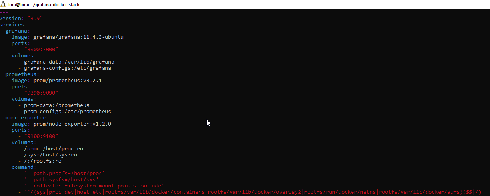
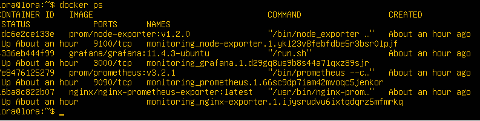
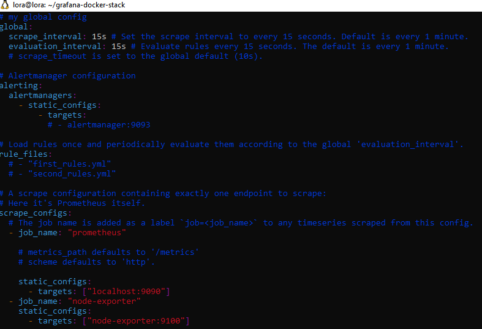
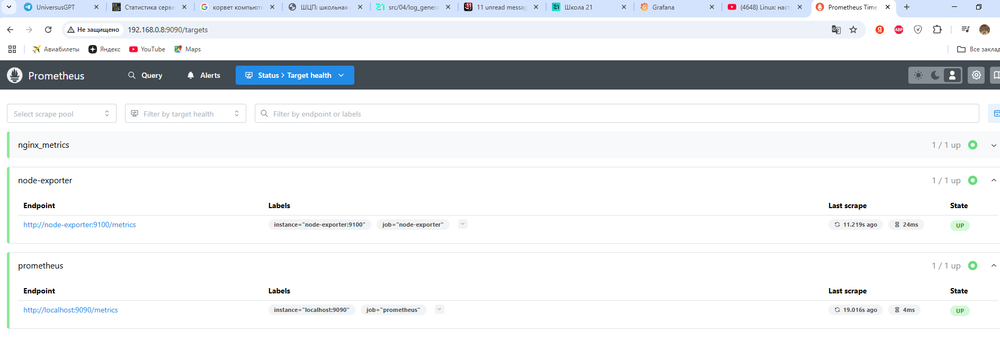
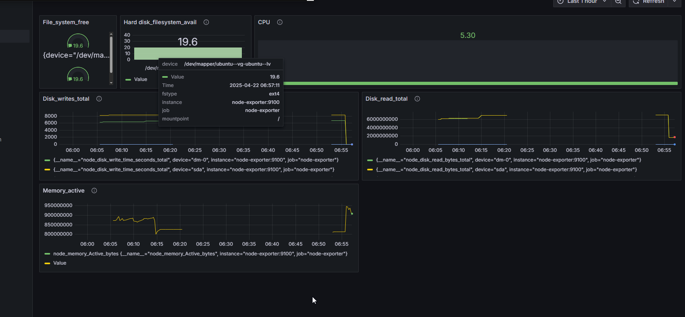
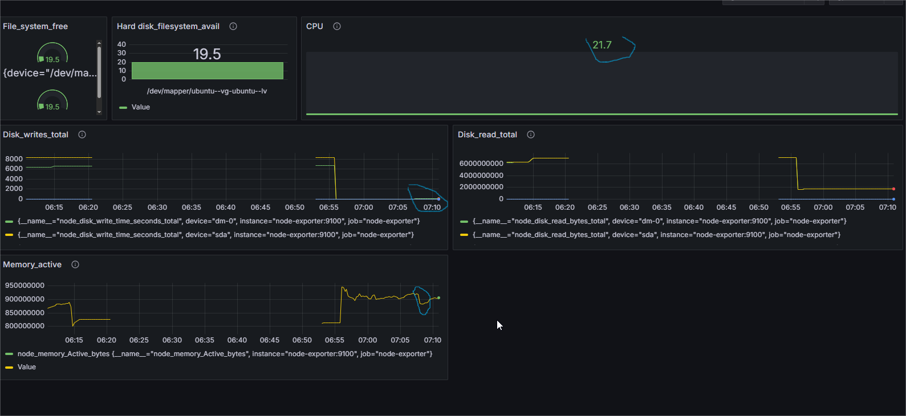
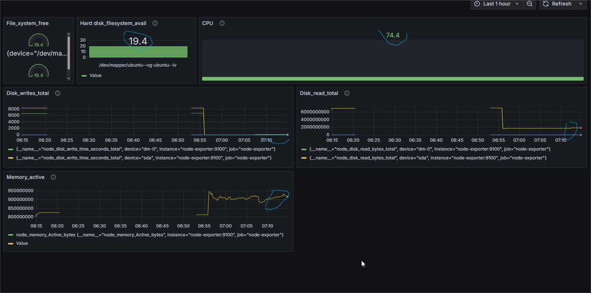

## Part 7. **Prometheus** и **Grafana**

**== Задание ==**

##### Установи и настрой **Prometheus** и **Grafana** на виртуальную машину.
##### Получи доступ к веб-интерфейсам **Prometheus** и **Grafana** с локальной машины.

##### Добавь на дашборд **Grafana** отображение ЦПУ, доступной оперативной памяти, свободное место и кол-во операций ввода/вывода на жестком диске.

##### Запусти свой bash-скрипт из [Части 2](#part-2-засорение-файловой-системы).
##### Посмотри на нагрузку жесткого диска (место на диске и операции чтения/записи).

##### Установи утилиту **stress** и запусти команду `stress -c 2 -i 1 -m 1 --vm-bytes 32M -t 10s`
##### Посмотри на нагрузку жесткого диска, оперативной памяти и ЦПУ.

Устанавливаю docker на ВМ `sudo apt install docker.io`.
Когда Docker установился, ввожу команду: `docker swarm init`.

Cоздаю директорию на виртуальной машине `grafana-docker-stack` c файлом `docker-compose.yml`.

Выполняю команду для развертывания стека: `docker stack deploy -c /home/lora/grafana-docker-stack/docker-compose.yml monitoring`

Контейнеры поднялись:

Вижу три контейнера: Grafana, Prometheus и Node Exporter. Затем захшла в браузер. У меня адрес сервера 192.168.0.8, Grafana доступна на порту 3000. 
После входа в Grafana добавила Prometheus в качестве источника данных. 

Настраеваю  promeyheus.yml

`sudo vim /var/lib/docker/volumes/monitoring_prom-configs/_data/prometheus.yml`

в браузере локальной машины на порту 9090 смотрю статус работы prometheus и node-exporter

Свой дашборд 

Устанавливаю и запускаю утилиту stress

Запускаю скрипт засорения файловой системы

