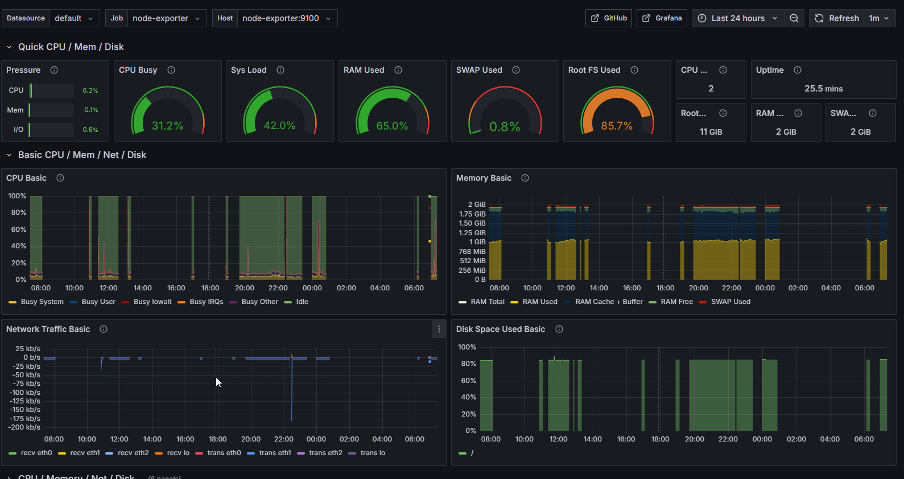
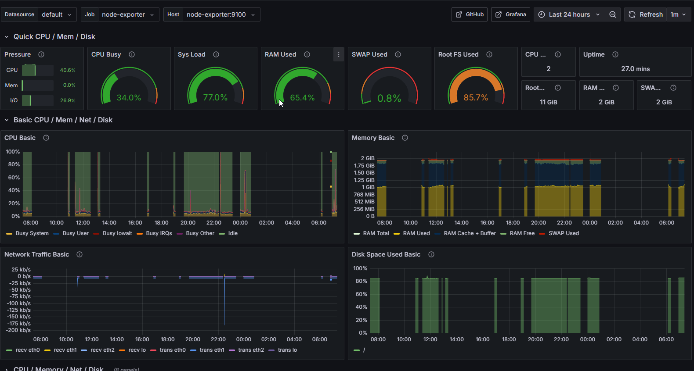
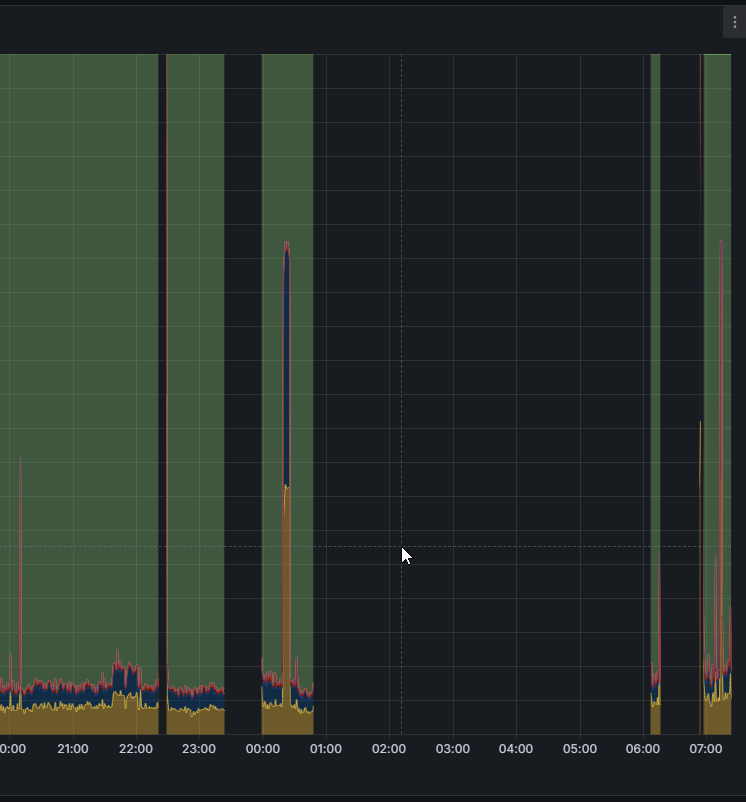
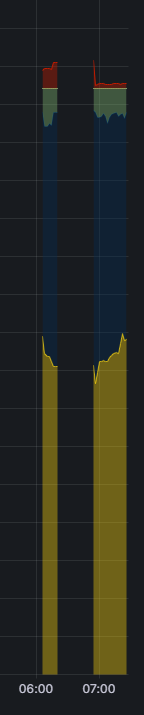
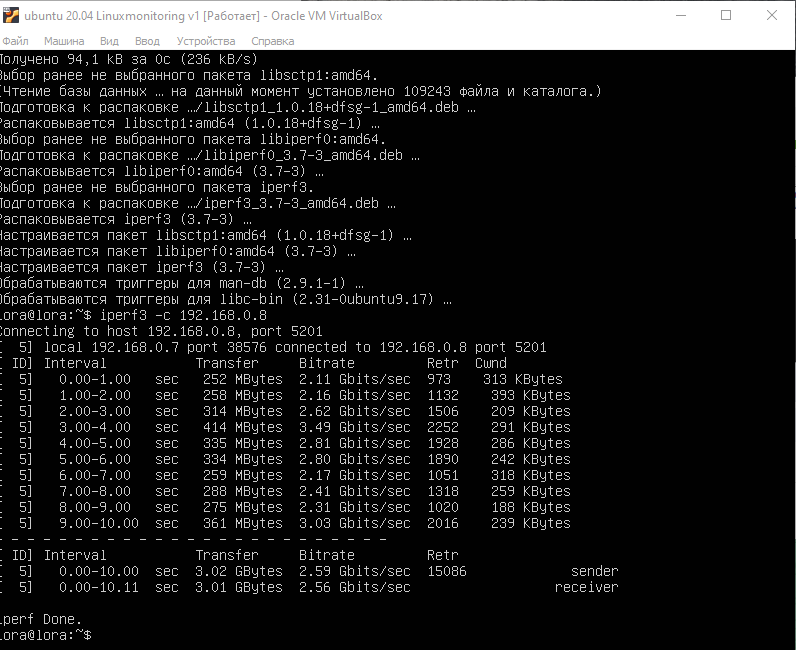
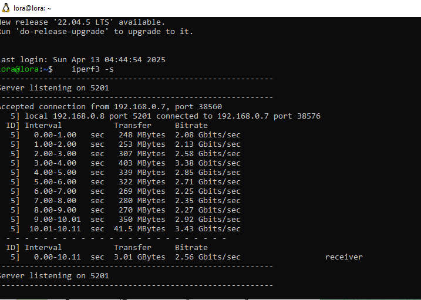
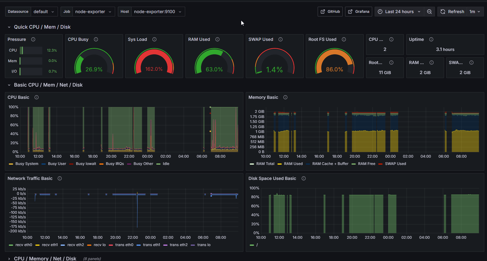
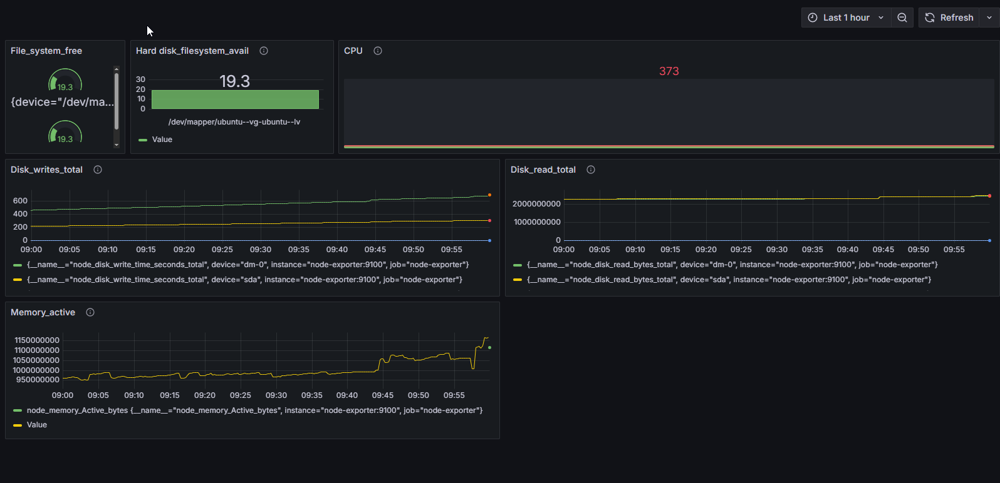

Part 8. Готовый дашборд

Почему бы не взять готовый дашборд, на котором есть все нужные метрики?
== Задание ==

Установи готовый дашборд Node Exporter Quickstart and Dashboard с официального сайта Grafana Labs.

Проведи те же тесты, что и в Части 7.

Запусти ещё одну виртуальную машину, находящуюся в одной сети с текущей.

Запусти тест нагрузки сети с помощью утилиты iperf3.

Посмотри на нагрузку сетевого интерфейса.

Скачала с официального сайта Grafana файл JSON готого дашборда Node Exporter Full. И импортировала его в grafana.

запустила утилиту stress 

запустила скрипт засорения системы  

Запустила вторую ВМ, установила на обе машины утилиту iperf3 `sudo apt install iperf3`.

Первая машина в режиме клиента `iperf3 -c 192.168.0.8`,

 вторая в режиме сервера `iperf3 -s`.

Машины пингуются друг с другом с использованием IP-адреса  с настройкой адаптера - сетевой мост.

 

