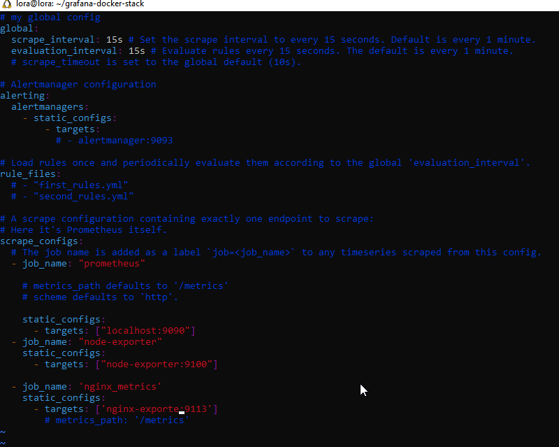
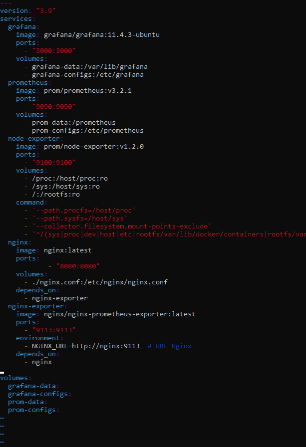
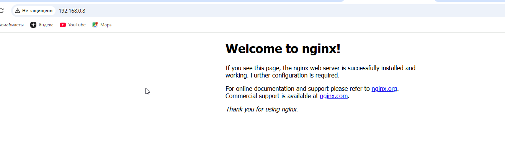
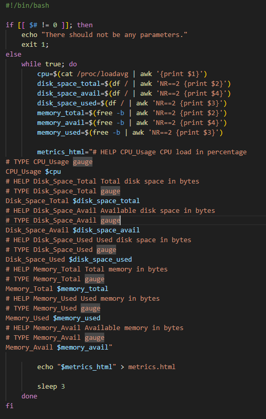
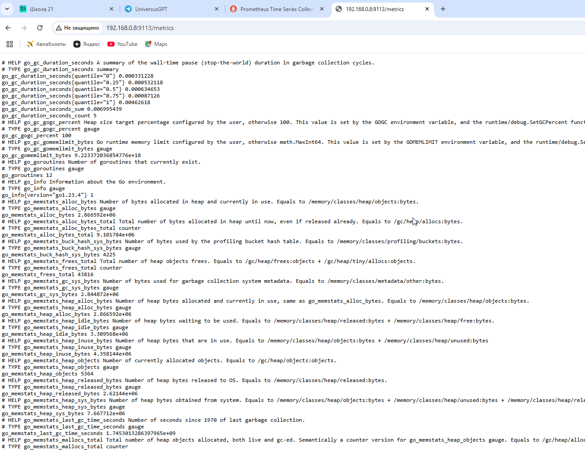
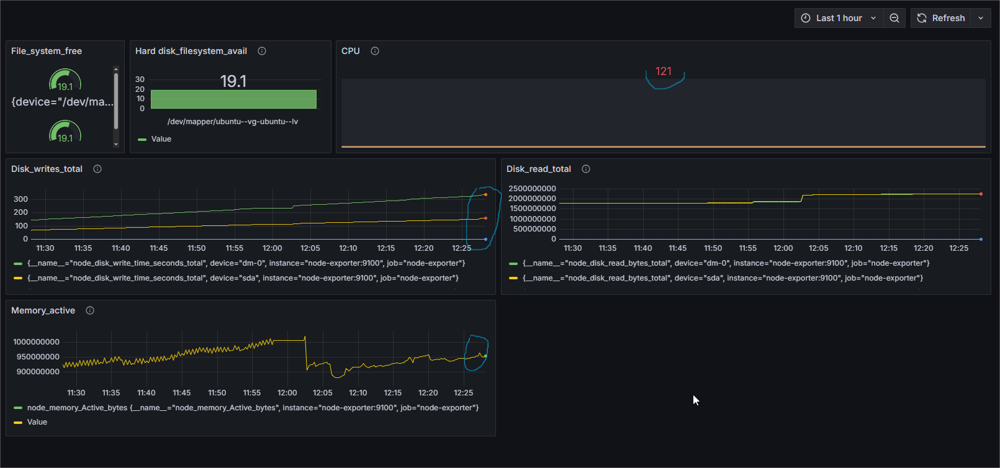
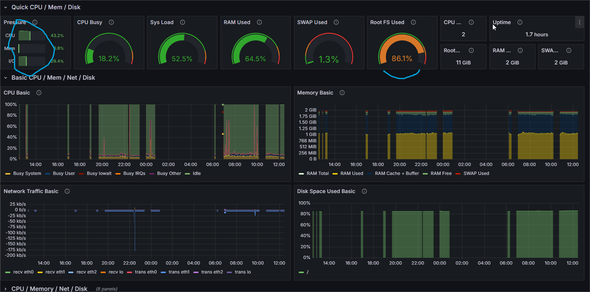
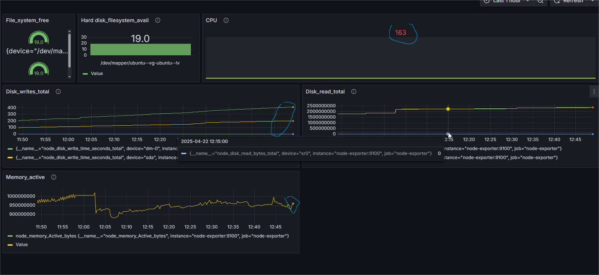
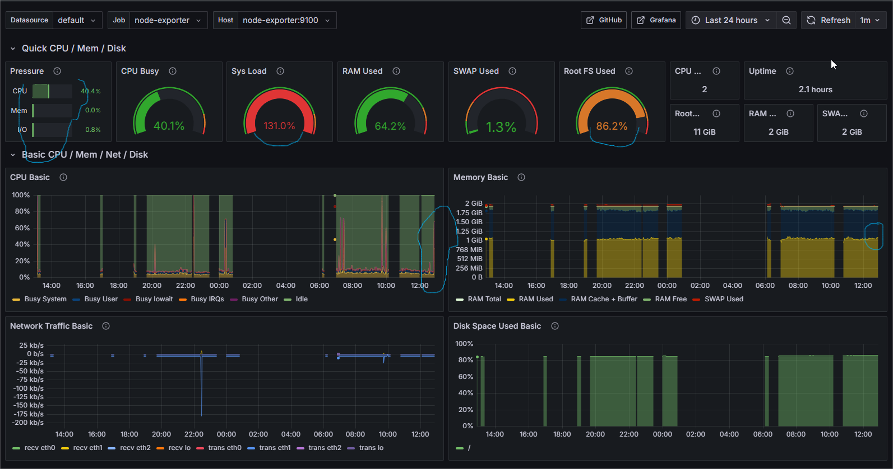

## Part 9. Дополнительно. Свой *node_exporter*

**== Задание ==**

Напиши bash-скрипт или программу на С, собирающие информацию по базовым метрикам системы (ЦПУ, оперативная память, жесткий диск (объем)).
Скрипт или программа должна формировать html страничку по формату **Prometheus**, которую будет отдавать **nginx**. \
Саму страничку обновлять можно как внутри bash-скрипта или программы (в цикле), так и при помощи утилиты cron, но не чаще, чем раз в 3 секунды.

Настраиваю Prometheus для сбора метрик со страницы. Открыла файл конфигурации Prometheus  и добавила новый job:

 `sudo vim /var/lib/docker/volumes/monitoring_prom-configs/_data/prometheus.yml`

   - job_name: 'system_metrics'
    static_configs:
      - targets: ['localhost:8080']
    metrics_path: '/metric
    Делаю релоад конфига, посылаю сигнал сигхап контейнеру prometheus 
    `docker ps | grep prometheus`
    `docker kill -s SIGHUP e519a3a856b1 `

  

  Настраиваю docker-compose, добавляю nginx-exporter, enginx.

  

  

  Запускаю скрипт 

  

  Метрики будут передавиться nginx-exporter по порту 9113.

  

  Prometheus Status/Targets 

  

  Команды протестирования конфигурации, после внесения изменений 
  `nginx -t` , `sudo systemctl relod nginx`

##### Поменяй конфигурационный файл **Prometheus**, чтобы он собирал информацию с созданной тобой странички.

##### Проведи те же тесты, что и в [Части 7](#part-7-prometheus-и-grafana).

Тест stress 

 

 

 Засорение системы

  

 