## Part 1. Готовый докер
Взять официальный докер образ с nginx и выкачать его при помощи docker pull
- 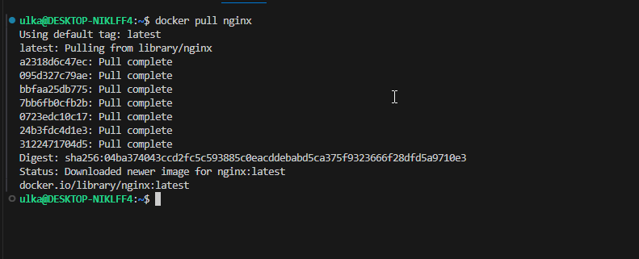

Проверить наличие докер образа через docker images
- 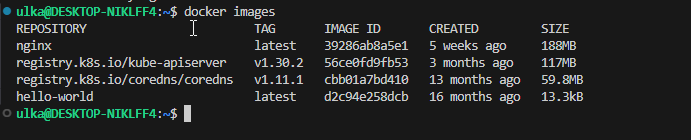

Запустить докер образ через docker run -d [image_id|repository]
- 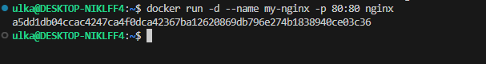

Проверить, что образ запустился через docker ps
- 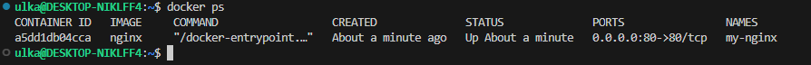

Посмотреть информацию о контейнере через docker inspect [container_id|container_name]

- 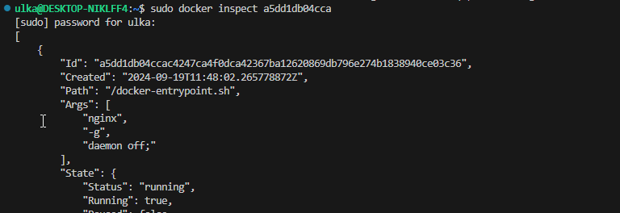

По выводу команды определить и поместить в отчёт размер контейнера, список замапленных портов и ip контейнера

IP

- 

size

- 

ports

- 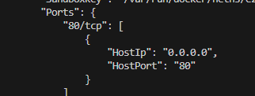

Остановить докер образ через docker stop [container_id|container_name]
- 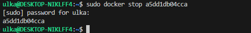

Проверить, что образ остановился через docker ps
- 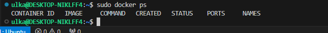

Запустить докер с портами 80 и 443 в контейнере, замапленными на такие же порты на локальной машине, через команду run
- 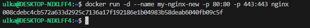

Проверить, что в браузере по адресу localhost:80 доступна стартовая страница nginx
- 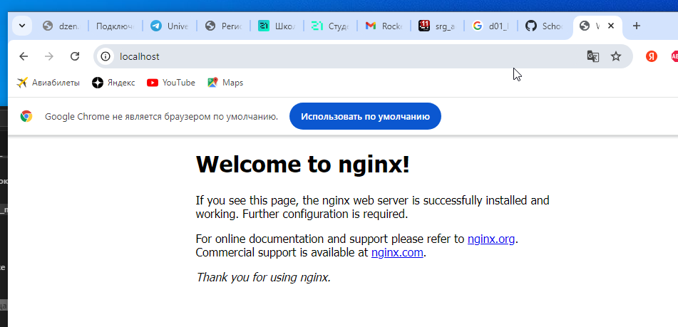

Перезапустить докер контейнер через docker restart [container_id|container_name]
- 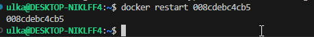

Проверить любым способом, что контейнер запустился
- 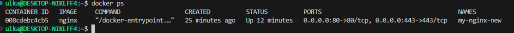

## Part 2. Операции с контейнером

Прочитать конфигурационный файл nginx.conf внутри докер контейнера через команду exec
- 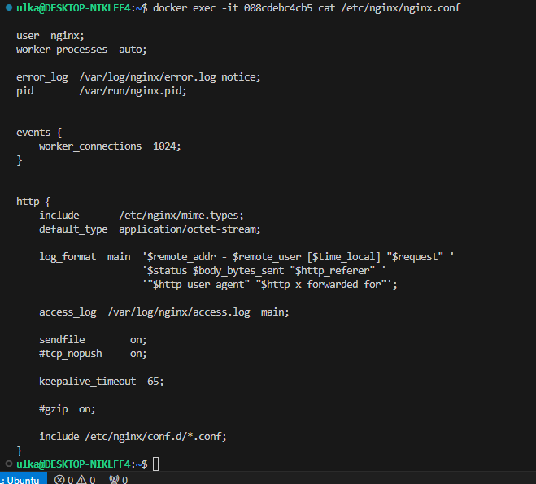

Создать на локальной машине файл nginx.conf

- 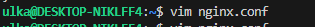

Настроить в нем по пути /status отдачу страницы статуса сервера nginx
- 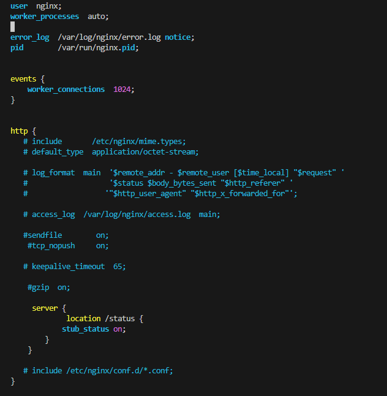

Скопировать созданный файл nginx.conf внутрь докер образа через команду docker cp
- 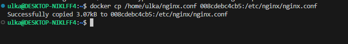

Перезапустить nginx внутри докер образа через команду exec
- 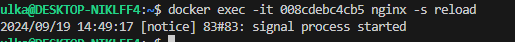

Проверить, что по адресу localhost:80/status отдается страничка со статусом сервера nginx
- 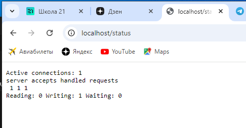
Теперь страница статуса отображает информацию о активных соединениях. 
Объяснение статуса:
- Active connections: 1: Это количество текущих активных соединений с сервером.
- server accepts handled requests:
- 1 (accepts): Количество соединений, которые сервер принял.
- 1 (handled): Количество соединений, которые сервер обработал (обычно совпадает с количеством принятых, если ошибок не было).
- 1 (requests): Общее количество запросов, полученных сервером.
- Reading: 0: Количество соединений, которые сервер читает данные от клиента.
- Writing: 1: Количество соединений, которые сервер отправляет данные клиенту.
- Waiting: 0: Количество соединений, которые находятся в режиме ожидания (для keep-alive соединений).

Экспортировать контейнер в файл container.tar через команду export
- 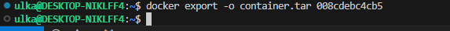

Остановить контейнер
(переделала все с контенером 7250dfa40cfc)

- 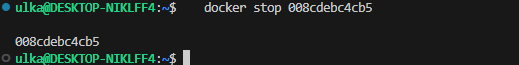

Удалить образ через docker rmi [image_id|repository], не удаляя перед этим контейнеры
- 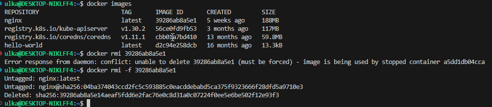

Удалить остановленный контейнер

- 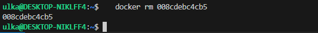

Импортировать контейнер обратно через команду import
- 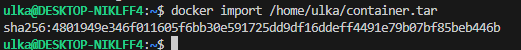

Запустить импортированный контейнер
- 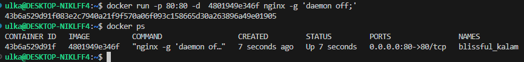

Проверить, что по адресу localhost:80/status отдается страничка со статусом сервера nginx
- 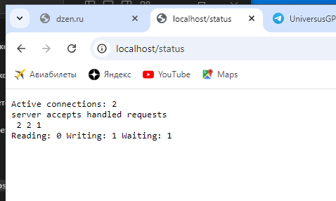

## Part 3. Мини веб-сервер

Написать мини сервер на C и FastCgi, который будет возвращать простейшую страничку с надписью Hello World!

 Установилa компилятор GCC.

- 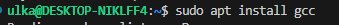

Для компиляции программы установилa библиотеку FastCGI.

- 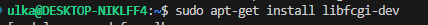

Создайлa файл hello.c с следующим содержимым:

- 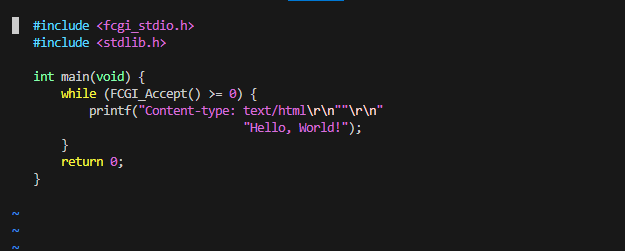

Скомпилировала.

- 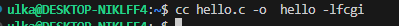

- 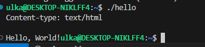

Установила пакет spawn-fcgi.

- 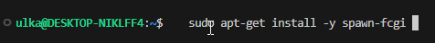

Запустила мини-сервера через spawn-fcgi.

- 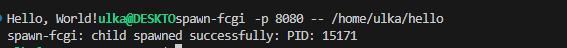

- 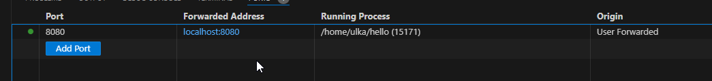

Создалф файл конфигурации Nginx nginx.conf со следующим содержимым:

- 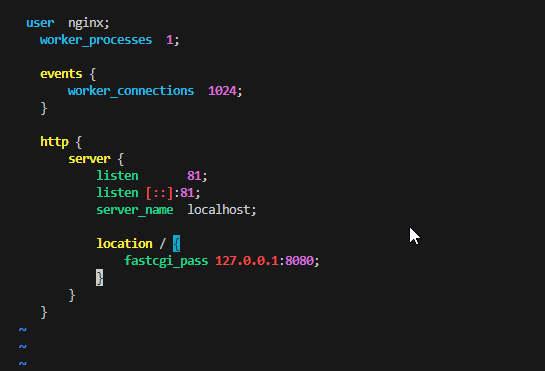

- Данный набор команд выполняет развертывание и настройку веб-сервера Nginx с использованием Docker, а также компиляцию и запуск FastCGI приложения. Давайте разберем каждую из команд по порядку:

1. **Загрузка образа Nginx:**
   `docker pull nginx`
   - Команда загружает последний доступный образ Nginx из Docker Hub
2. **Запуск контейнера Nginx:**
   - 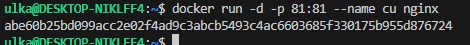
   - Запускается контейнер с именем `cu` в фоновом режиме (`-d`) и перенаправляется порт 81 на хосте на порт 81 в контейнере. 
   - Получаюдоступ к веб-серверу Nginx по адресу `http://localhost:81`.

3. **Копирование файлов в контейнер:**
   - 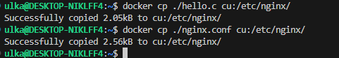
   - 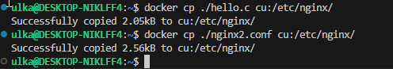
   - Копирую файл `hello.c` и файл конфигурации `nginx.conf` из текущей директории на хосте в директорию `/etc/nginx/` внутри контейнера.

4. **Обновление списка пакетов в контейнере:**
   - 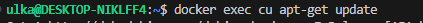
   - Команда обновляет список пакетов внутри контейнера, чтобы можно было установить последние версии необходимых пакетов.

5. **Установка необходимых пакетов:**
   - 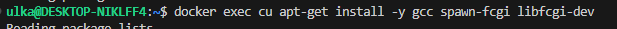
   - Здесь происходит установка компилятора GCC, а также библиотек `spawn-fcgi` и `libfcgi-dev`, которые необходимы для работы с FastCGI.

6. **Компиляция FastCGI приложения:**
   - 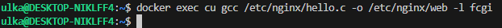
   Компилирую файл `hello.c` в исполняемый файл `web`, который будет использовать библиотеку FastCGI.

7. **Запуск FastCGI приложения:**
   - 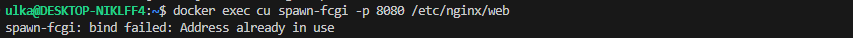
   - Запускаю FastCGI приложение на порту 8080 с помощью утилиты `spawn-fcgi`.

8. **Перезагрузка Nginx:**
   - 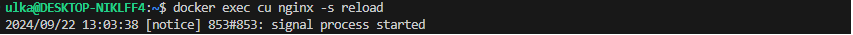
   - Перезагружаю сервер Nginx, чтобы применить изменения конфигурации 

9. **Отправка запроса к серверу:**
  - 
   Команда отправляет HTTP-запрос к Nginx на локальном хосте, чтобы проверить, работает ли сервер и отвечает ли он корректно.

- В результате выполнения этих команд получаю работающий веб-сервер Nginx, который может обрабатывать запросы с использованием FastCGI приложения, написанного на C.

- Проверяю, что в браузере по адресу *localhost:80* доступна стартовая страница **nginx**

- 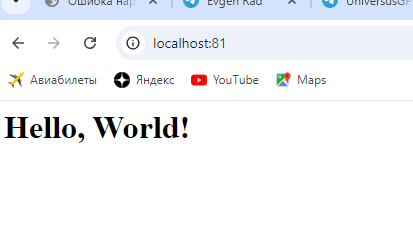

- Поместилa файл конфигурации Nginx по нужному пути
- Создалa директорию `nginx` и поместил `nginx.conf` в нее:

- 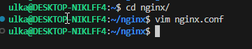

## Part 4. Свой докер

При написании докер образа избегайте множественных вызовов команд RUN

Написать свой докер образ, который:

В директории fastcgi-nginx создала Dockerfile:
- 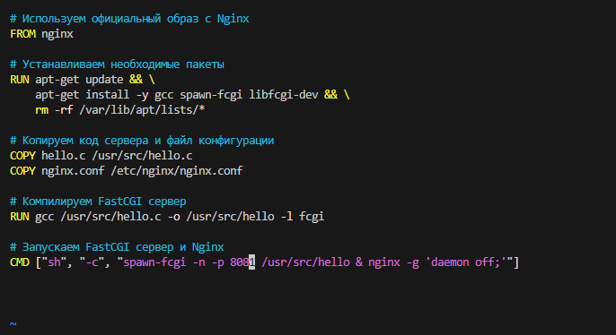

Сборку образа произвела при помощи команды `docker build -t fastcgi-nginx:222 .`, указав имя и тег. 
- 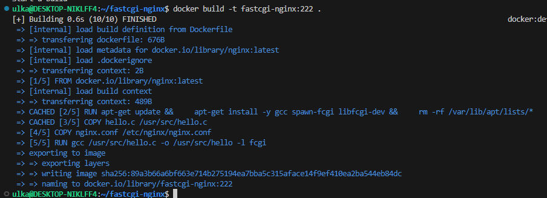

Проверила через docker images, что все собралось корректно
- 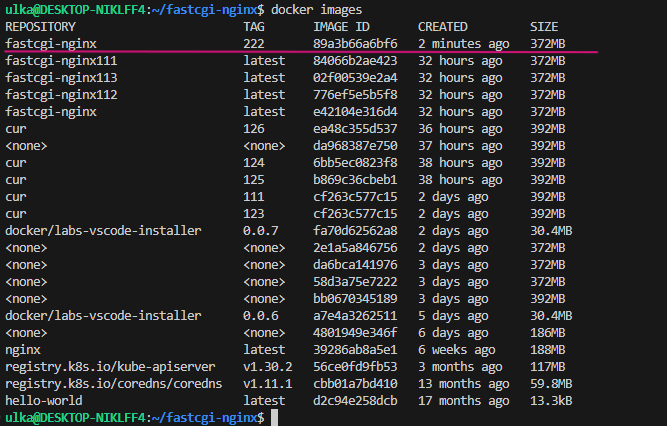

Запустила собранный докер образ с маппингом 81 порта на 80 на локальной машине и маппингом папки ./nginx внутрь контейнера по адресу, где лежат конфигурационные файлы nginx'а (см. Часть 2)
- 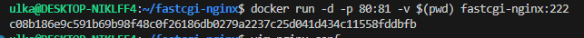

Проверить, что по localhost:80 доступна страничка написанного мини сервера
- 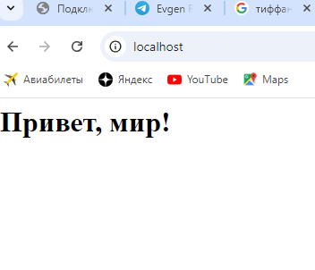

Дописала в nginx.conf проксирование странички /status, по которой надо отдавать статус сервера nginx
- 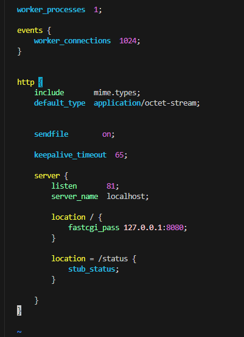

Перезапустить докер образ
Если всё сделано верно, то, после сохранения файла и перезапуска контейнера, конфигурационный файл внутри докер образа должен обновиться самостоятельно без лишних действий

Проверила, что теперь по localhost:80/status отдается страничка со статусом nginx
- 

## Part 5. Dockle

 Обновлила список доступных пакетов и их версий с репозиториев и установленные пакеты до их последних доступных версий при помощи команд `sudo apt update && sudo apt upgrade`.

Создала файл `install_dockle.sh`, который содержит скрипт для установки Dockle.

Сделала файл исполняемым и запустила скрипт установки утилиты:

- 

Просканировала образ из предыдущего задания через dockle [image_id|repository]

- 

Необходимо исправить образ так, чтобы при проверке через dockle не было ошибок и предупреждений.

Ошибки:

 1. Ошибка: CIS-DI-0010
#### Do not store credentials in environment variables/files
- Проблема: В  Dockerfile есть ENV переменная NGINX_GPGKEYS, содержащая GPG ключи. Хранение конфиденциальной информации (таких как ключи доступа) в средних переменных окружения небезопасно.
- Решение: Вместо передачи ключей через переменные окружения рассмотреть возможность их передачи через более защищенные механизмы или удалить их после использования.

 2. Предупреждение: CIS-DI-0001
#### Create a user for the container
- Проблема: Контейнер работает от имени пользователя root, что увеличивает риск безопасности.
- Решение: Создайть отдельного пользователя для  приложения в образе. 

 3. Информация: CIS-DI-0005
#### Enable Content trust for Docker
- Рекомендация: Включить доверие к контенту при использовании docker pull/build. Для этого выполнила команду:
`export DOCKER_CONTENT_TRUST=1`

 4. Информация: CIS-DI-0006
#### Add HEALTHCHECK instruction to the container image
- Проблема: В образе отсутствует HEALTHCHECK, который позволяет Docker проверять, работает ли контейнер корректно.
- Решение: Добавить в  Dockerfile HEALTHCHECK:
`HEALTHCHECK CMD curl --fail http://localhost/ || exit 1`

 5. Информация: CIS-DI-0008
#### Confirm safety of setuid/setgid
- Рекомендация: Проверить, используется ли  setuid или setgid в контейнере и действительно ли это необходимо для  приложения. Если не нужно, лучше избегать их использования.  Что такое setuid и setgid?
- setuid (Set User ID): Если установлен, программа будет выполняться с правами пользователя, которому принадлежит файл. Это необходимо, например, для таких команд, как passwd, su, которые требуют повышенных прав для выполнения своих функций.
- setgid (Set Group ID): Если установлен, программа будет выполняться с правами группы, которой принадлежит файл. Это используется, например, для команд, связанных с управлением группами.
### Риски
Файлы с установленными битами setuid и setgid могут быть уязвимы, если в программном коде содержатся ошибки, которые возможно использовать злоумышленникам для повышения своих привилегий.
### Как управлять этими файлами?
1. Проверка необходимости: Убедиться, что каждая программа с установленным битом setuid или setgid действительно требует его для своей работы. Некоторые программы могут быть небезопасными, если они старые или плохо написаны.
2. Обновление программ: Убедиться, что все программы в  системе актуальны. Обновления часто содержат исправления безопасности и могут закрыть известные уязвимости.
3. Мониторинг: Использовать инструменты мониторинга для отслеживания изменений в этих файлах. Любое изменение в бинарных файлах с установленными битами setuid или setgid должно вызывать настороженность.
4. Ограничение доступа: Убедиться, что доступ к командам с setuid и setgid ограничен только теми пользователями, которые действительно нуждаются в них.

Исправленный dockerfile
- 

Команды `chown -R Ulka:Ulka /etc/nginx/nginx.conf; \
    chown -R Ulka:Ulka /var/cache/nginx; \
    chown -R Ulka:Ulka /home; \
    touch /var/run/nginx.pid; \
    chown -R Ulka:Ulka /var/run/nginx.pid; \` Изменяют владельца (пользователя и группу) файла. Команда /var/run/nginx.pid изменяет на пользователя Ulka. Этот файл обычно используется Nginx для хранения PID процесса.

 Команды `chmod u-s /usr/bin/gpasswd; \
    chmod u-s /usr/bin/chsh; \
    chmod u-s /usr/bin/chfn; \
    chmod g-s /usr/bin/expiry; \
    chmod u-s /usr/bin/passwd; \
    chmod g-s /sbin/unix_chkpwd; \
    chmod g-s /usr/bin/chage; \
    chmod g-s /usr/bin/wall; \
    chmod u-s /bin/umount; \
    chmod u-s /bin/mount; \
    chmod u-s /usr/bin/newgrp; \
    chmod u-s /bin/su; \
    chmod u-s /usr/bin/chsh; \`  используют `chmod` для удаления флагов SetUID и SetGID. SetUID (u+s) на исполняемом файле позволяет пользователю запускать этот файл с правами владельца файла. Это может быть рискованно, если программа содержит уязвимости, так как злоумышленник может получить доступ к системным ресурсам. 
 SetGID (g+s) работает аналогично, но для групповых прав. Удаление этих флагов помогает повысить безопасность:
Например, программы, которые могут изменять пароли (passwd) или добавлять пользователей (gpasswd), должны запускаться с ограниченными правами, чтобы избежать возможного злоупотребления.

 Команда `rm -rf /var/lib/apt/lists;`  очищает кеш списков пакетов. Это может помочь уменьшить размер образа и предотвратить потенциальные риски безопасности, так как кеш содержит информацию о доступных пакетах и их версиях.

## Part 6. Базовый Docker Compose

Создала файл docker-compose.yml.

- 

В, дополнительно, созданной директории nginx2 написала еще один файл nginx.conf для второго конрейнера.

- 

Остановила все запущенные контейнеры командой `docker stop`.

Собралла и запустила проект с помощью команд `docker-compose build` и `docker-compose up`

- 

Проверила, что в браузере по localhost:80 отдается написанная страничка, как и ранее

- 