DevOps 8
Part 1. Удаленное конфигурирование узла через Ansible
В этой главе необходимо существить удаленную настройку узла для разворачивания мультисервисного приложения.

== Задание ==

Создать с помощью Vagrant три машины - manager (192.168.56.10), node01 (192.168.56.11), node02 (192.168.56.12). Не устанавливать с помощью shell-скриптов docker при создании машин на Vagrant! Прокинуть порты node01 на локальную машину для доступа к пока еще не развернутому микросервисному приложению.
Vagrantfile:

 - 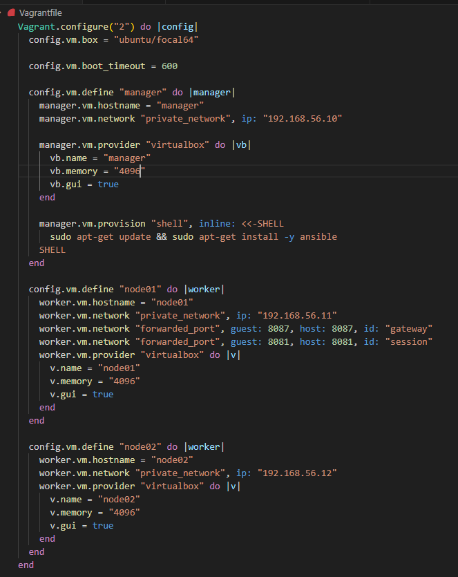
  Запускаю vagrant-файл
 - 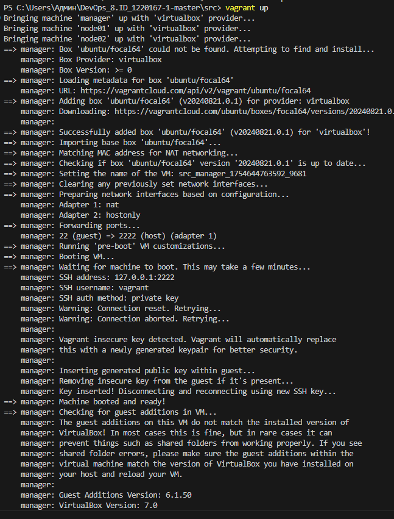
Проверяю статус вирт. машин
- 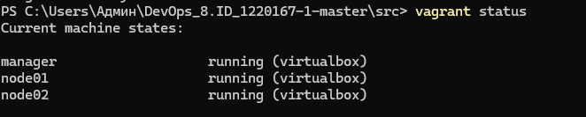
  # Настройка node02 (воркер Swarm)
Необходимо подготовить manager как рабочую станцию для удаленного конфигурирования (помощь по Ansible в материалах).
Для того, что бы машины подключались друг к другу, необходимо настроить вход без пароля, то есть скопировать сгенерированный ssh-ключ на manager на узловые машины. 
Временно разрешаю вход без пароля на каждой машине (захожу на каждую машину отдельно по ssh и настраиваю файл /etc/ssh/sshd_config): 
`vagrant ssh node01 sudo nano /etc/ssh/sshd_config`
`PasswordAuthentication no -> yes`
`sudo service sshd restart`
- 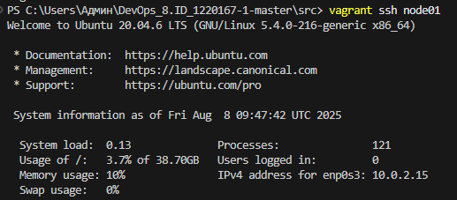
- 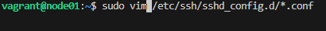
- 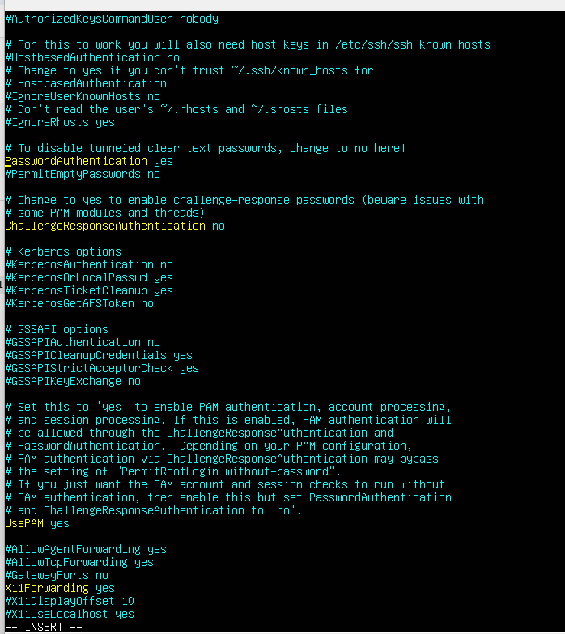
- 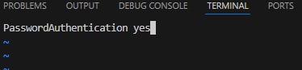
- 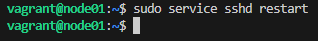
  Генерирую ключ и копирую его на другие машины node:
`ssh-keygen -C pt3`
`ssh-copy-id -i /home/vagrant/.ssh/id_rsa.pub 192.168.56.11`
- 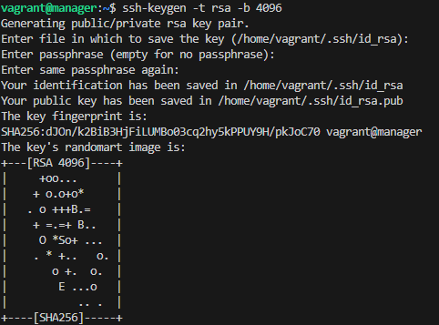
- 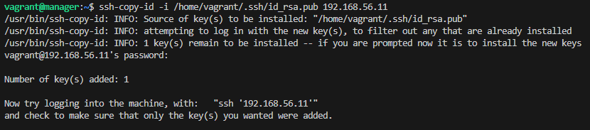

На manager проверяю подключение к node01 через ssh по приватной сети.
- 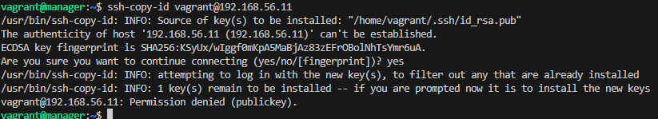
Скопировла manager docker-compose файл и исходный код микросервисов. (Проект из папки src и docker-compose файл из DevOps 7.)
- 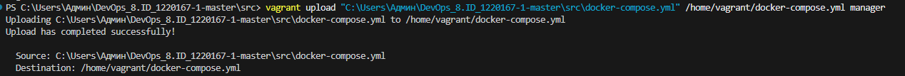
- 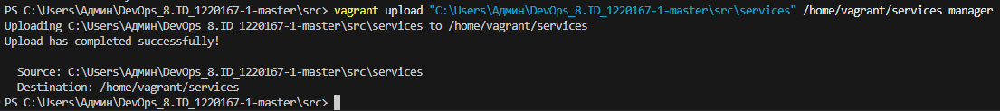
Создала папку ansible, в которой создать inventory-файл.
`sudo apt-get update && sudo apt-get install -y ansible`
`vim /ansible/inventory.ini`
- 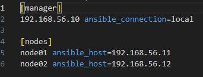

Использовала модуль ping для проверки подключения через Ansible.
`ansible -i inventory.ini nodes -m ping`:
- 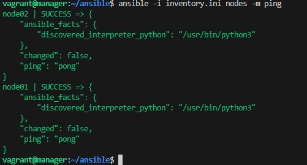

Необходимо написать первый плейбук для Ansible, который выполняет apt update, устанавливает docker, docker-compose, копирует compose-файл из manager'а и разворачивает микросервисное приложение.
- 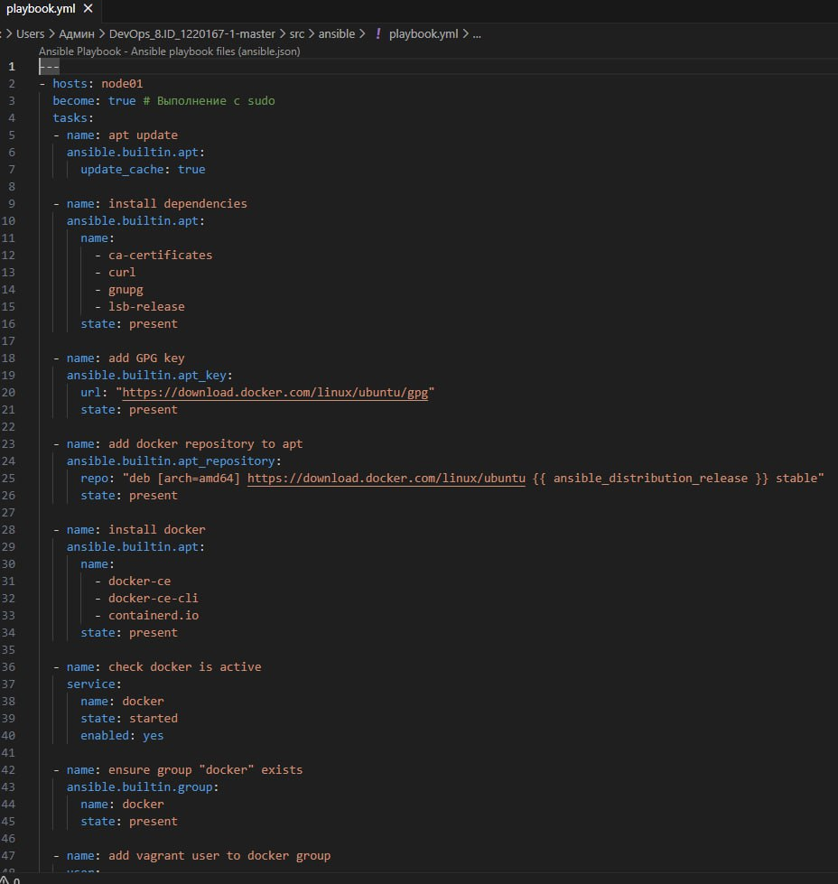
Ввожу команду `docker login -u loraleea`, так как образы хостятся на Docker Hub в аккаунте loraleea — без docker login плейбук может не сработать на чистых машинах. После запуска плейбук логин сохранится ~/.docker/config.json.
- 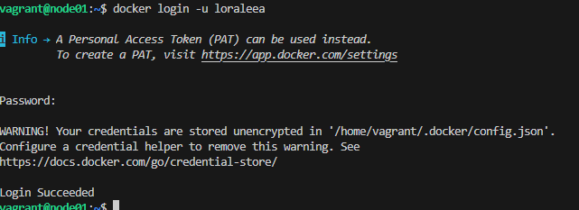
Запустила плейбук командой 
`ansible-playbook -i inventory.ini playbook.yml`
- 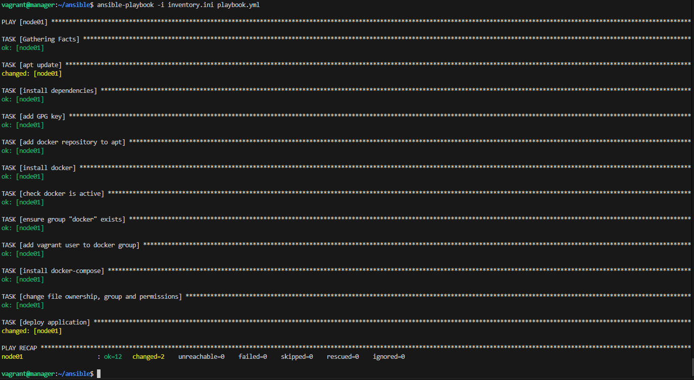
Проверила работу контейнеров:
- 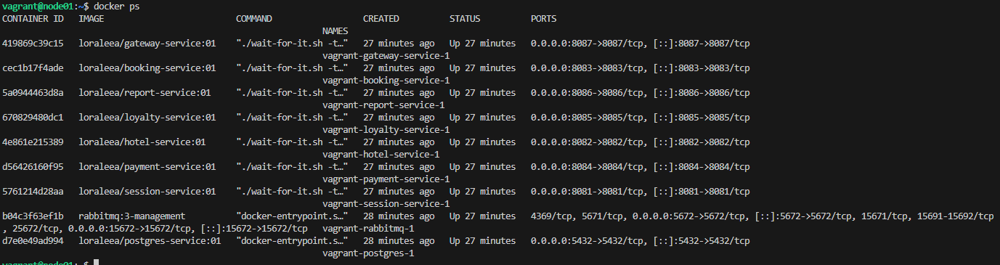
Запустила заготовленные тесты через postman и удостоверилась, что все они проходят успешно.
- 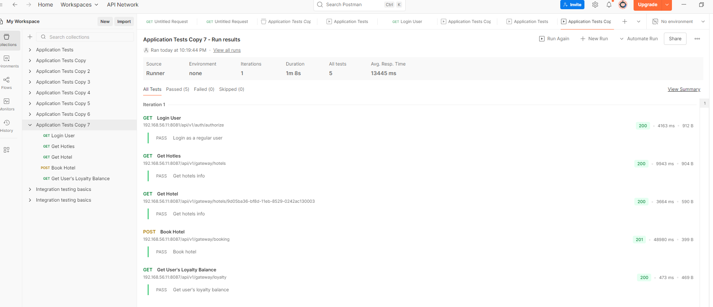
По заданию необходимо назначить первую роль node01 и вторые две роли node02, проверить postman-тестами работоспособность микросервисного приложения, удостовериться в доступности postgres и apache-сервера. Для Apache веб-страница должна открыться в браузере. Что касается PostgreSQL, необходимо подключиться с локальной машины и отобразить содержимое ранее созданной таблицы с данными. Основной playbook:
- 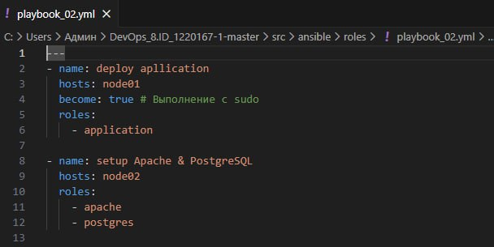
Далее сформировала три роли:
application выполняет развертывание микросервисного приложения при помощи docker-compose.
application/tasks/main.yml:
- 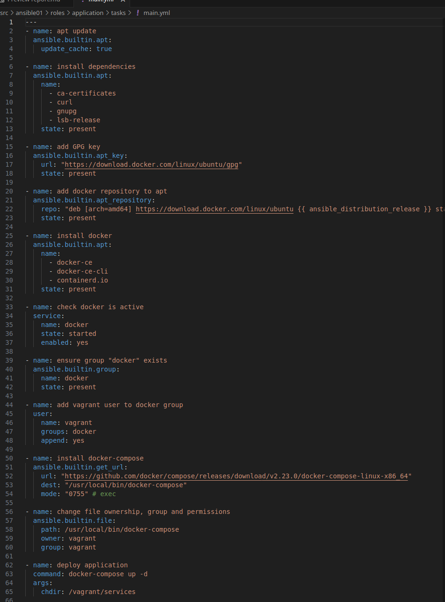
apache устанавливает и запускает стандартный apache сервер. 
apache/tasks/main.yml:
- 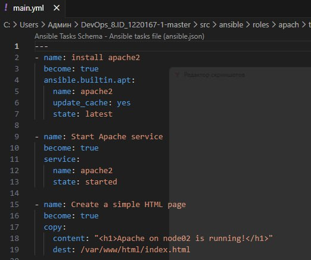
    
postgres устанавливает и запускает postgres, создает базу данных с произвольной таблицей и добавляет в нее три произвольные записи.
- 
Для использования community модуля нужно вызвать команду на manager:
`ansible-galaxy collection install community.postgresql`
- 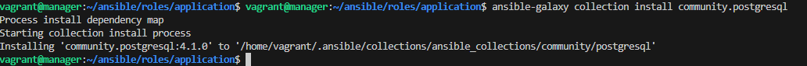
postgres/tasks/main.yml:
- 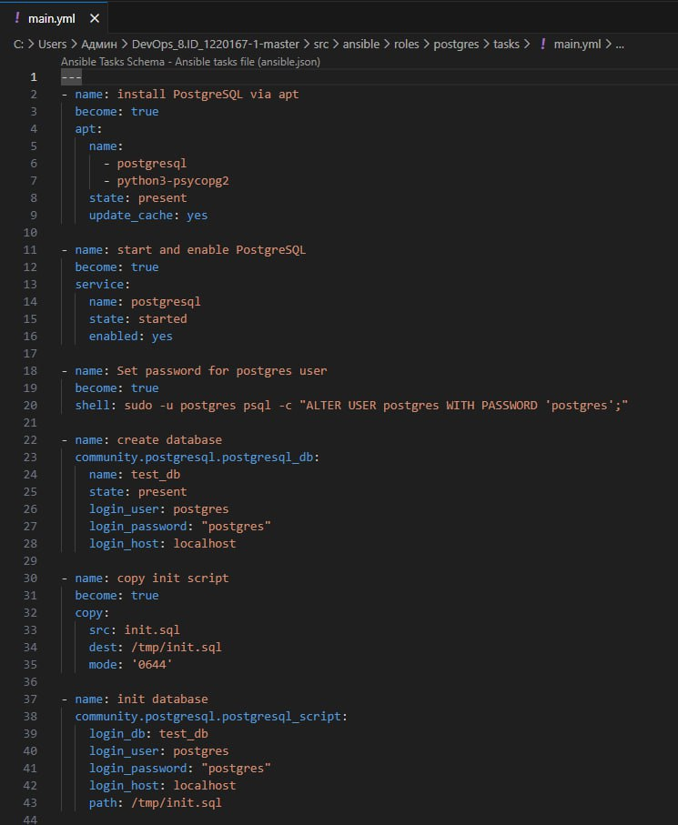
Скрипт для БД init.sql:
- 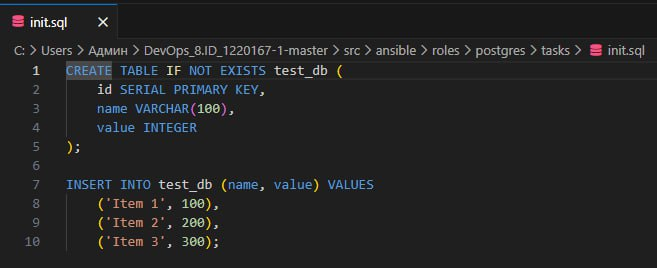
Пинг между машинами проходит успешно:
- 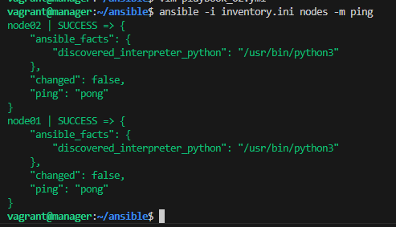
Playbook успешно выполняет работу:
- 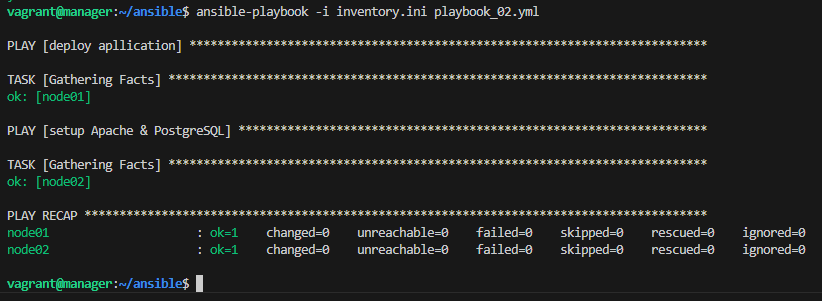

Для удаленного подключения psql к node02 (192.168.56.12) нужно на node02 настроить:
https://www.strongdm.com/blog/connect-to-postgres-database
`sudo nano /etc/postgresql/12/main/postgresql.conf`
- 
listen_addresses='192.168.56.12'
`sudo systemctl restart postgresql`
- 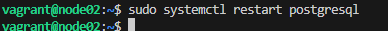
`sudo vim /etc/postgresql/12/main/pg_hba.conf`
- 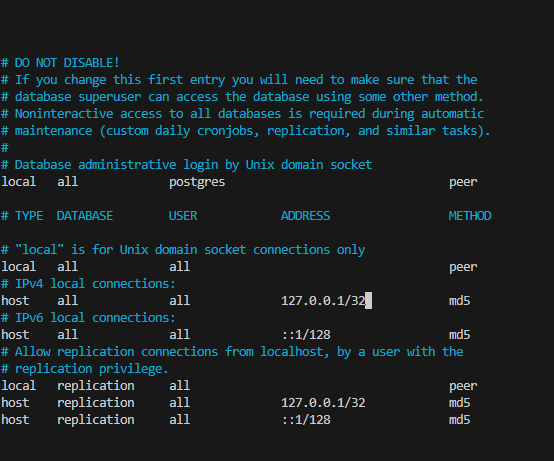
host all all 0.0.0.0/0 md5 \
Просмотр конфигураций cat /etc/postgresql/12/main/postgresql.conf, настройка удалённого доступа — параметр listen_addresses = '192.168.56.12' означает, что PostgreSQL принимает подключения не только с localhost, но и с IP 192.168.56.12.
- 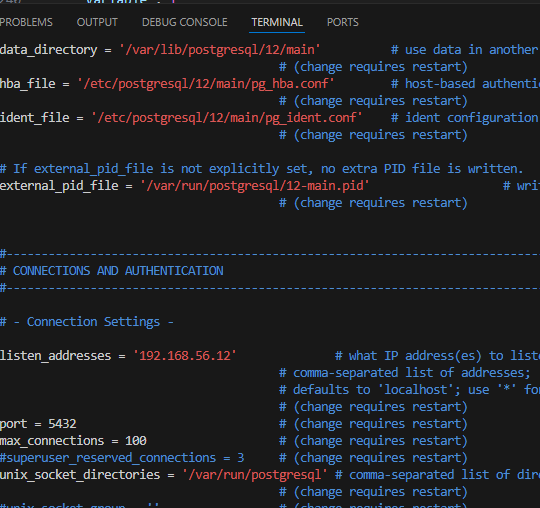
Вывод успешной установки PostgreSQL.
- 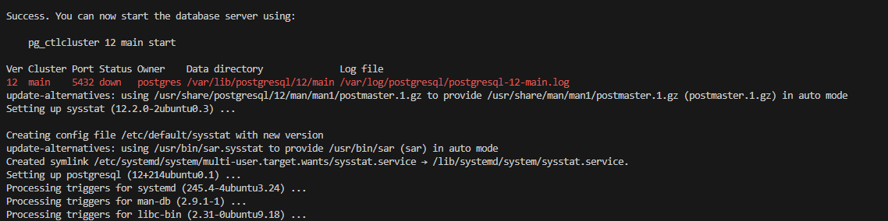
- 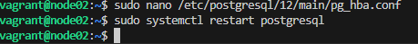
Сервер apache отображается в браузере:
- 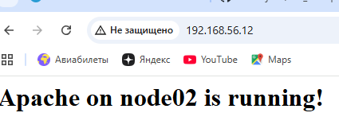
Удаленный запрос psql с локальной машины:
- 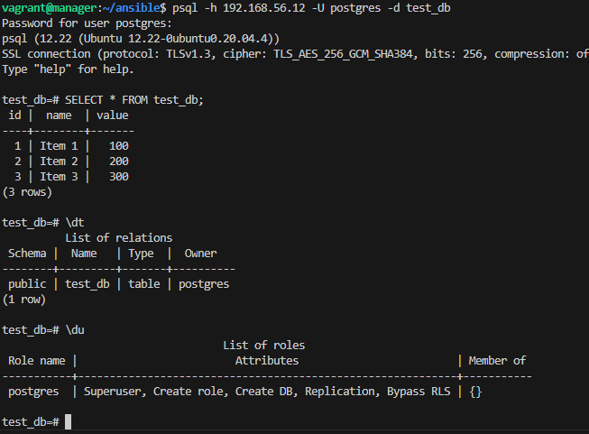

Part 2. Service Discovery
Теперь перейдем к обнаружению сервисов. Необходимо cымитировать два удаленных сервиса - api и БД, и осуществить между ними подключение через Service Discovery с использованием Consul.

== Задание ==

Написать два конфигурационный файла для consul:
consul_server.hcl:
Требуется настроить агент как сервер;
указать в advertise_addr интерфейс, направленный во внутреннюю сеть Vagrant
- 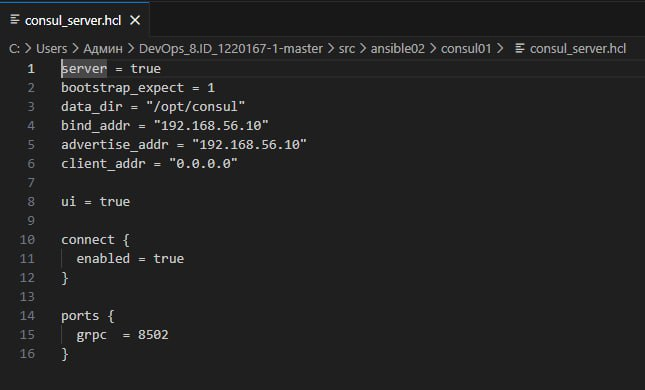

consul_client.hcl.j2:
Требуется настроить агент как клиент;
указать в advertise_addr интерфейс, направленный во внутреннюю сеть Vagrant
- 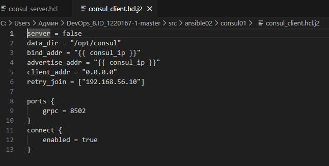

consul_client.hcl.j2 (jinja2 templates) позволяет динамически вставлять переменные а конфигурационные фалйы. consul_ip берётся из inventory файла и для db и api машин будут подставляться свои ip адреса.

Так же необходимо создать с помощью Vagrant четыре машины - consul_server, api, manager и db.
Прокинуть порт 8082 с api на локальную машину для доступа к пока еще не развернутому api
Прокинуть порт 8500 с manager для доступа к ui consul.
- 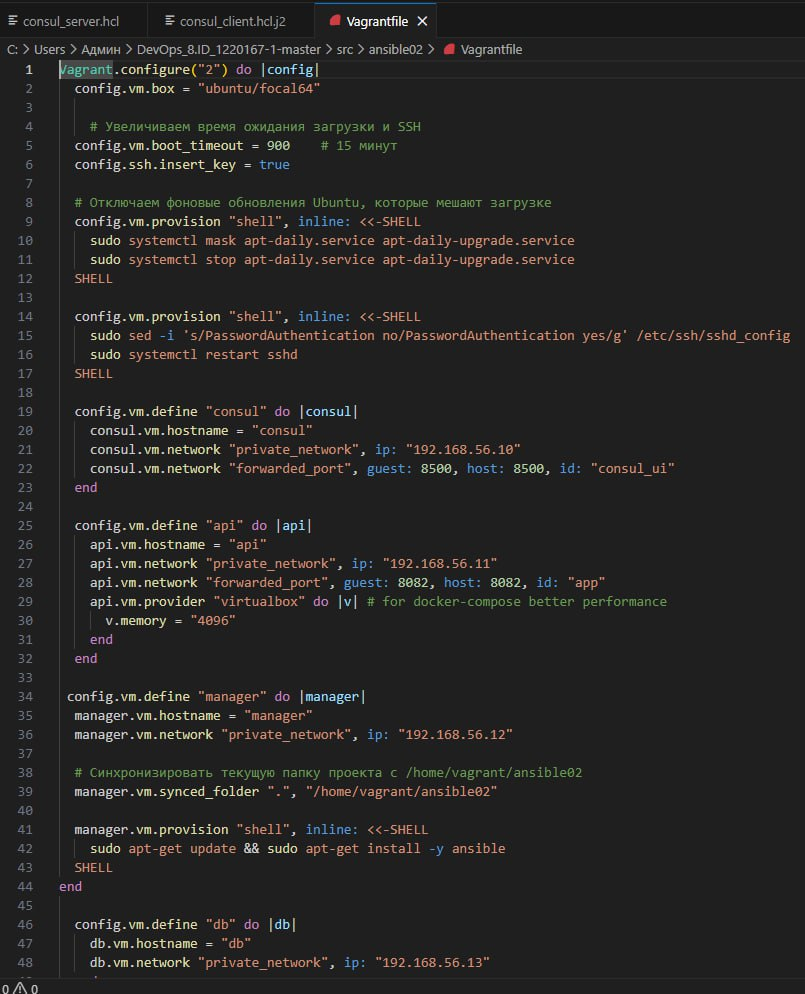
Написать плейбук для ansible и четыре роли:
Роль install_consul_server, которая:
работает с consul_server;
копирует consul_server.hcl;
устанавливает consul и необходимые для consul зависимости;
запускает сервис consul;
- 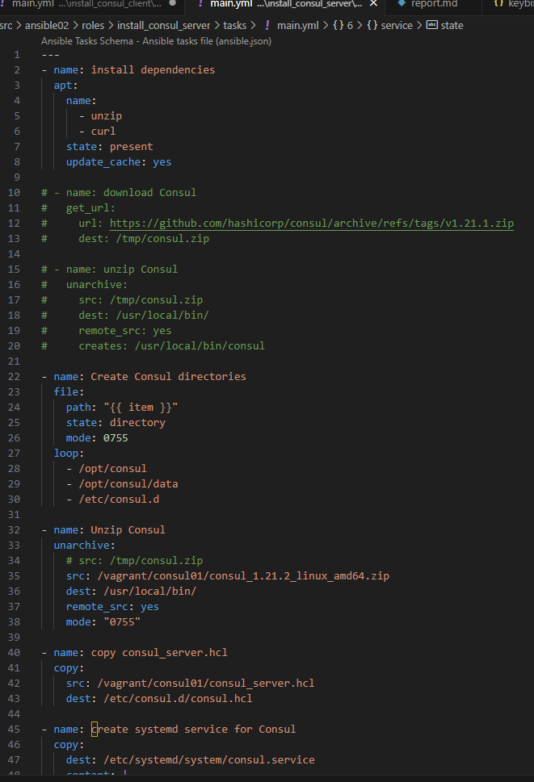

Роль install_consul_client, которая:
работает с api и db;
копирует consul_client.hcl;
устанавливает consul, envoy и необходимые для consul зависимости;
запускает сервис consul и consul-envoy;
- 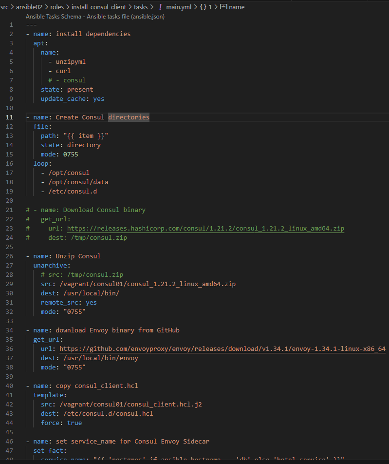

Роль install_db, которая:
работает с db;
устанавливает postgres и запускает его;
создает базу данных hotels_db;
- 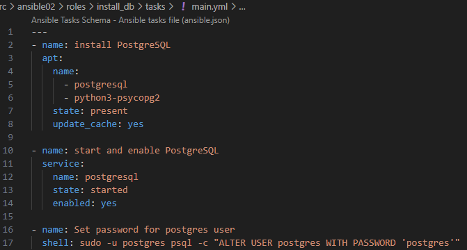
- Роль install_hotels_service, которая:
работает с api;
копирует исходный код сервиса
устанавлвиает openjdk-8-jdk
создает глобальные переменные окружения:
POSTGRES_HOST="127.0.0.1"
POSTGRES_PORT="5432"
POSTGRES_DB="hotels_db"
POSTGRES_USER="<имя пользователя>"
POSTGRES_PASSWORD="<пароль пользователя>"
запускает собранный jar-файл командой java -jar <путь до hotel-service>/hotel-service/target/<имя jar-файла>.jar
- 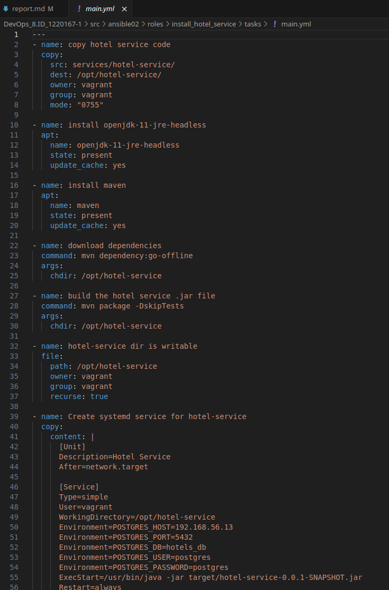

playbook.yml:
- 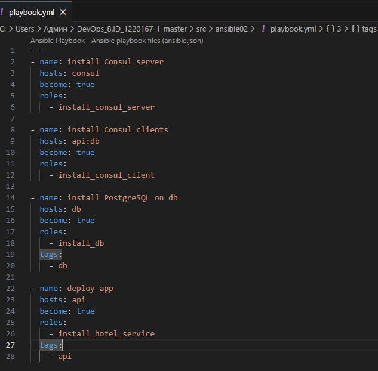
Playbook отработал удачно 
- 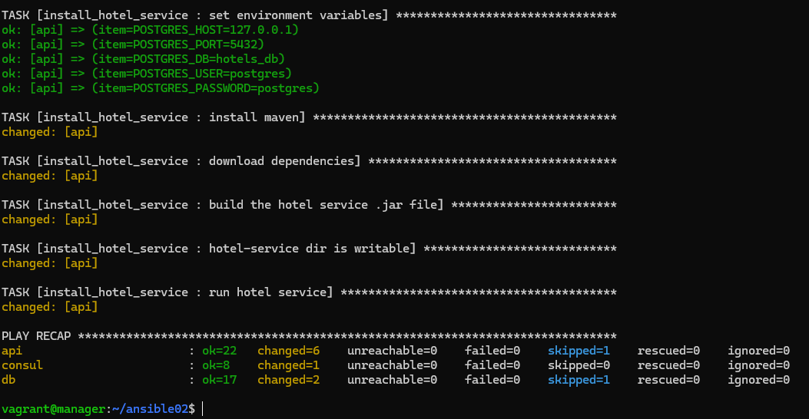
Интерфейс Consul (localhost:8500), где видно 3 сервиса, объединенных друг с другом в Service Mesh, что обеспечивает авторизацию и шифрование соединений между сервисами с использованием протокола защиты транспортного уровня (TLS), а "голый" трафик сервисов никогда не покидает конкретный узел.
- 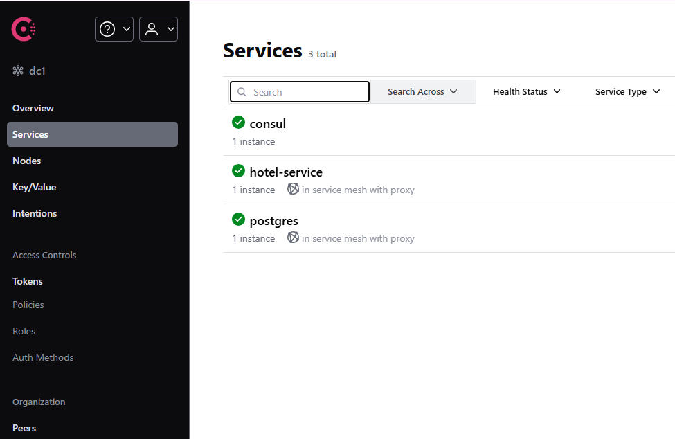

hotel-services/instances. Здесь находятся healthcheck'и, а также видно, что существует прокси Envoy, к которому обращается микросервис.
- 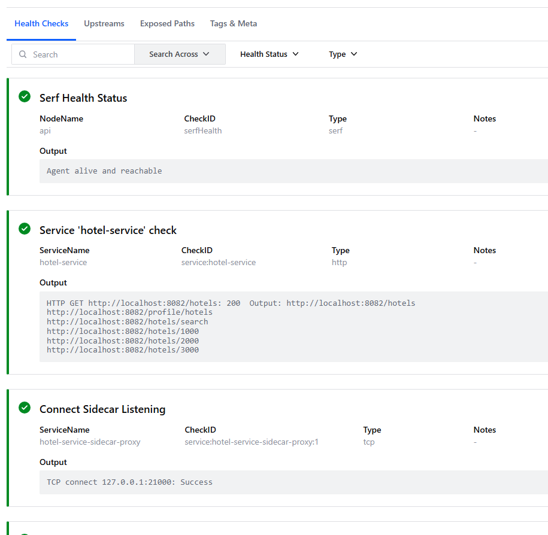

Аналогично для сервиса postgres
- 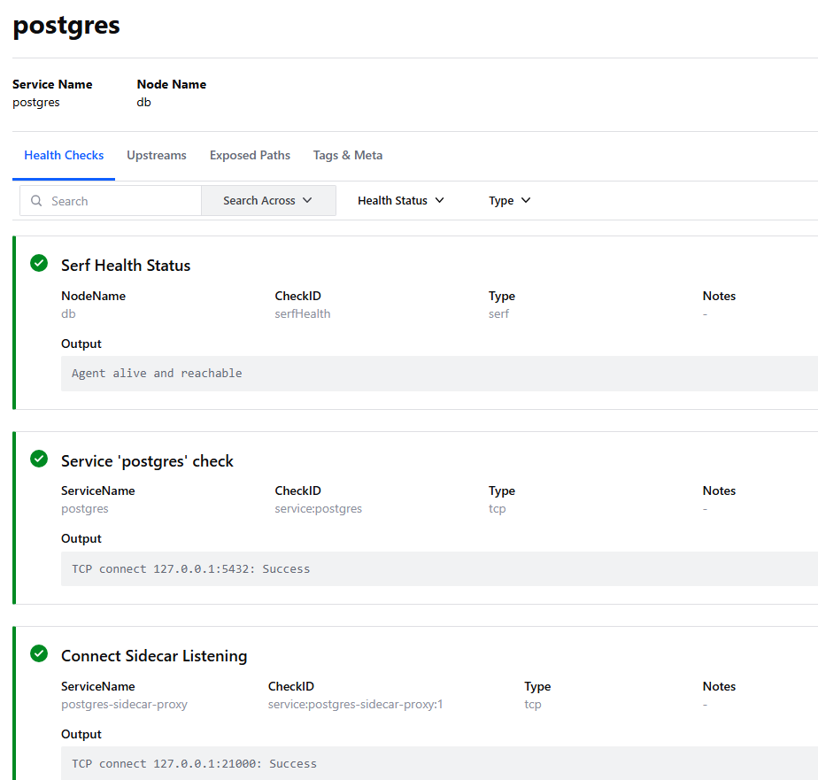

Проверяю работоспособность CRUD-операций над сервисом отелей. 
POST запрос, добавила новый отель. GET запрос, где видно новый добавленный отель.
- 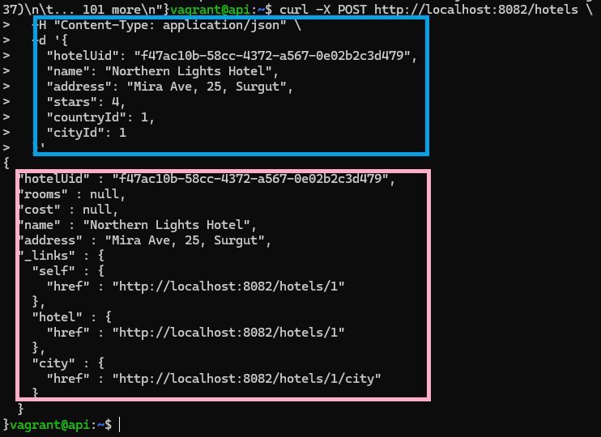
Запрос через браузер https:localhost:8082/hotels, на скриншоте видны параметры нового отеля.
- 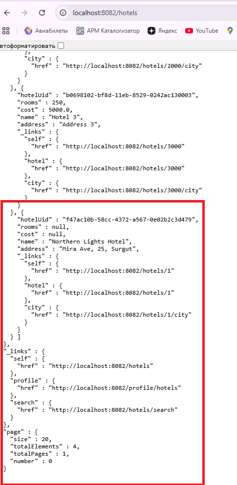
