# Основы оркестрации контейнеров

## Part 1. Запуск нескольких docker-контейнеров с использованием docker compose
**== Задание ==**

1) Напиши Dockerfile для каждого отдельного микросервиса. Необходимые зависимости описаны в материалах. В отчете отобрази размер собранных образов любого сервиса различными способами.

Создаем докер файлы для каждого из сервисов и создаем образы.
    Всего получается 9 сервисов:
    1) База данных postgres.
    2) Очередь сообщений rabbitmq.
    3) Session service - сервис управляющий сессиями пользователей.
    4) Hotel service - сервис управляющий сущностью отелей.
    5) Payment service - сервис управляющий оплатой.
    6) Loyalty service - сервис управляющий программой лояльности.
    7) Report service - сервис осуществляющий сбор статистики.
    8) Booking service - сервис управляющий резервированием.
    9) Gateway service - фасад для взаимодействия с остальными микросервисами 

  Сначала написала Dockerfile для каждого микросервиса, кроме брокера rabbitmq. Использую его стандартный образ, при запуске docker-compose.yml он скачается сам с github. Пример dockerfile.
- 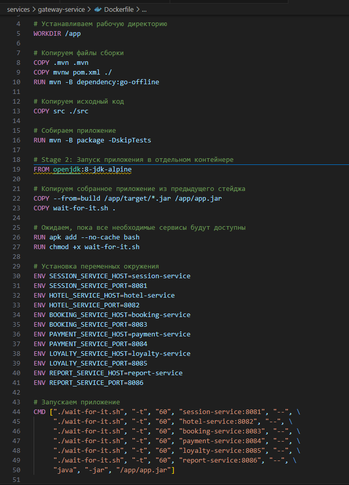
  
Cобрала образы сервисов.
Команда сборки образа: `docker build -t "name_image:latest" .`

  База данных postgres
  
 - 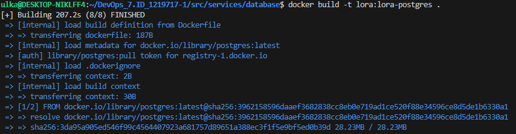

  Hotel service
 - 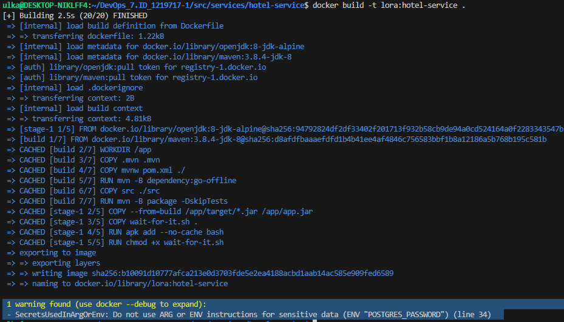

  Payment service
 - 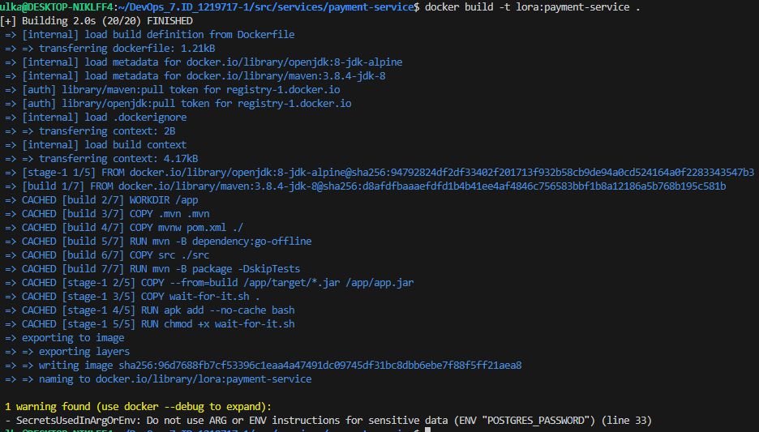
  
  Loyalty service 
 - 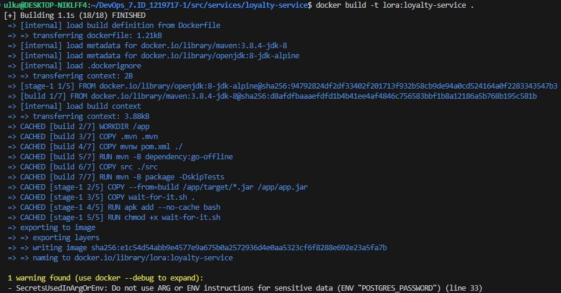
  
  Report service
 - 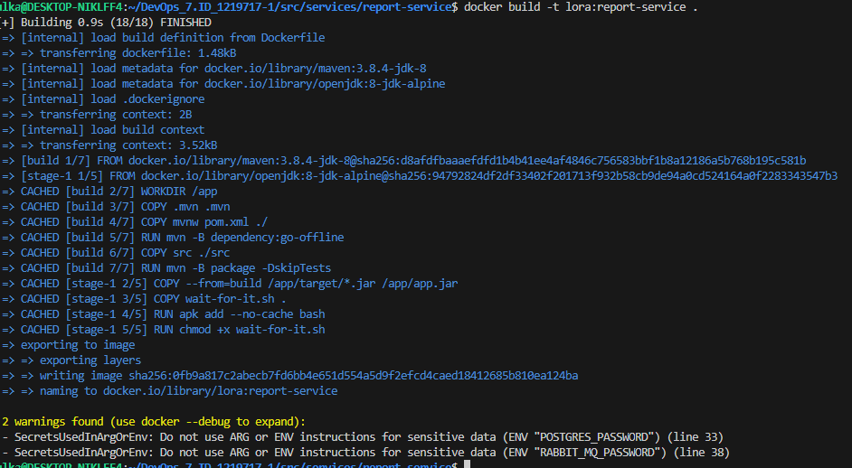

  Booking service 
 - 

  Gateway service
 - 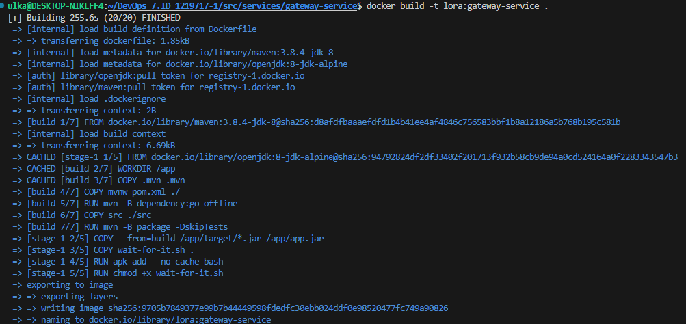

  Nginx service 
 - 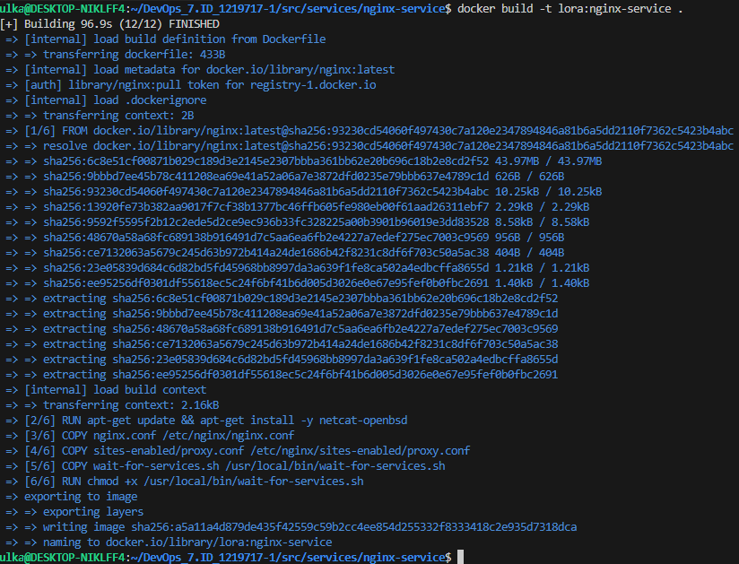 

Проверяю размер образа различными способами:

- а) Через `docker images`
 - 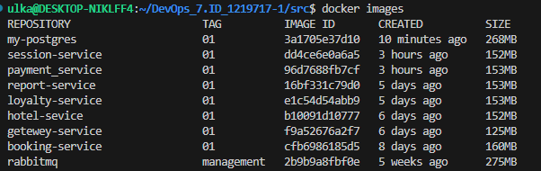
  
- б) Через `docker images inspect "name-ID"`

 - 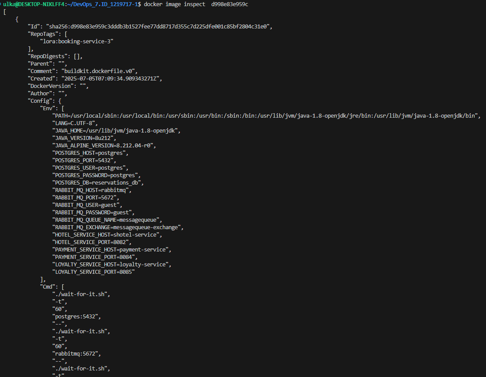 
 - 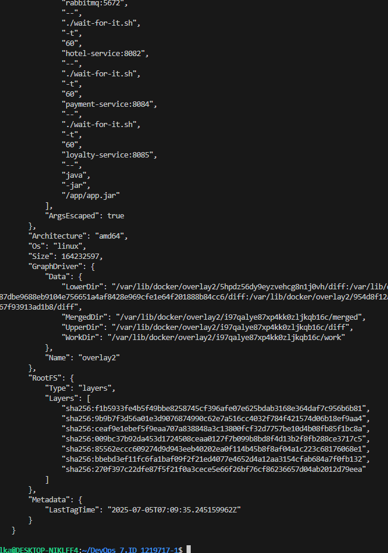

- в) Через `docker system df`

- 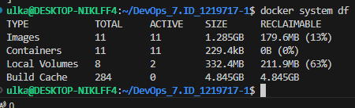

- г) Вывод (в байтах): Команда
`for image in $(docker images --format "{{.Repository}}:{{.Tag}}" | grep -v "<none>:<none>"); do \
  size=$(docker image inspect $image --format='{{.Size}}'); \
  echo -e "$image\t$size"; \
done`

- 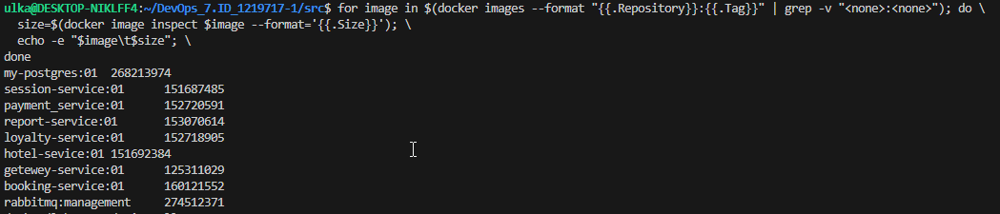

1) Напиши docker-compose файл, который осуществляет корректное взаимодействие сервисов. Пробрось порты для доступа к gateway service и session service из локальной машины. Помощь по docker compose ты найдешь в материалах.
   
   Написала docker-compose.yml. Пока работаю на WSL2, образы запускала то же с нее.

- 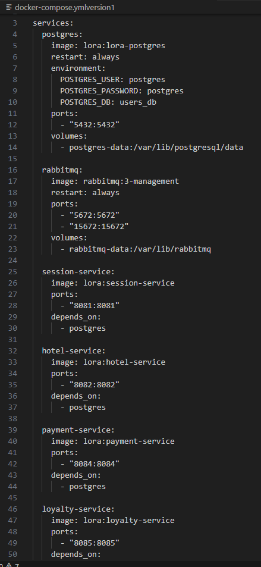
- 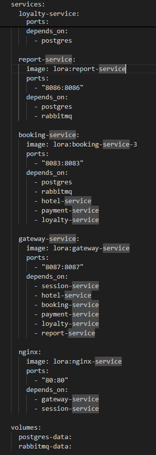

2) Собери и разверни веб-сервис с помощью написанного docker compose файла на локальной машине.
   Собираю и поднимаю стек командой: `docker-compose -p hotel-stack up -d`

- 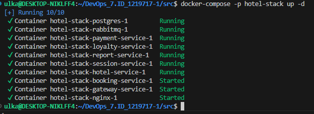
- 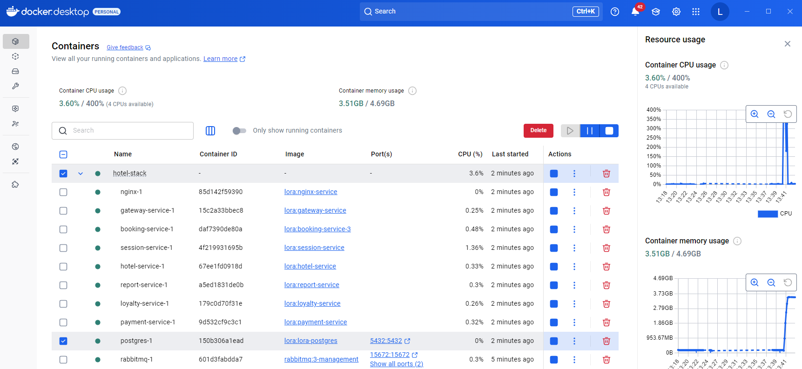

проверяю список поднявшихся контейнеров командой: `docker ps`

- 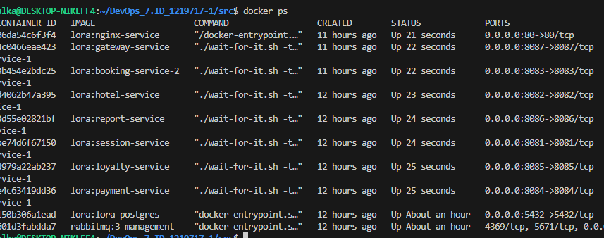

1) Прогони заготовленные тесты через postman и удостоверься, что все они проходят успешно. Инструкцию по запуску тестов можно найти в материалах. В отчете отобрази результаты тестирования.
   
Установила postman и импортировала в него тест-скрипт application_tests.postman_collection.json,запустила run to applycation test. 

- 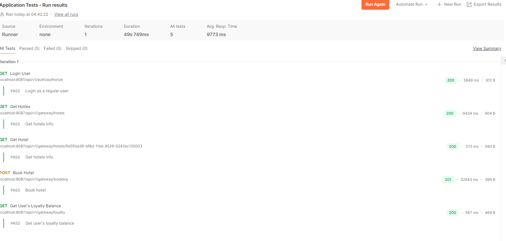
- 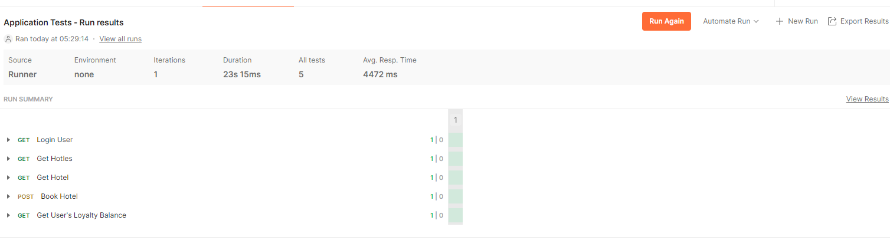
   Вот результат выполнения тестов "Application Tests" от 5 июля 2025 года: все 5 тестов прошли успешно, ошибок не было. Общая продолжительность тестирования составила примерно 22,36 секунды.

### Резюме по каждому тесту:

1. **Вход пользователя (Login User)**  
   - Адрес: `localhost:8081/api/v1/auth/authorize`  
   - Код ответа: 200 OK  
   - Тест: "Войти как обычный пользователь" — успешно  
   - Время выполнения: 1474 мс

2. **Получение информации о гостиницах (Get Hotels)**  
   - Адрес: `localhost:8087/api/v1/gateway/hotels`  
   - Код ответа: 200 OK  
   - Тест: "Получить информацию о гостиницах" — успешно  
   - Время выполнения: 2492 мс

3. **Получение информации о конкретной гостинице (Get Hotel)**  
   - Адрес: `localhost:8087/api/v1/gateway/hotels/9d05ba36-bf8d-11eb-8529-0242ac130003`  
   - Код ответа: 200 OK  
   - Тест: "Получить информацию о гостинице" — успешно  
   - Время выполнения: 519 мс

4. **Бронирование гостиницы (Book Hotel)**  
   - Адрес: `localhost:8087/api/v1/gateway/booking`  
   - Код ответа: 201 Created  
   - Тест: "Забронировать гостиницу" — успешно  
   - Время выполнения: 17 563 мс (около 17,5 секунд)

5. **Получение баланса лояльности пользователя (Get User's Loyalty Balance)**  
   - Адрес: `localhost:8087/api/v1/gateway/loyalty`  
   - Код ответа: 200 OK  
   - Тест: "Получить баланс лояльности пользователя" — успешно  
   - Время выполнения: 312 мс

## Part 2. Создание виртуальных машин
**== Задание ==**

1) Установи и инициализируй Vagrant в корне проекта. Напиши Vagrantfile для одной виртуальной машины. Перенеси в виртуальную машину исходный код веб-сервиса в рабочую директорию виртуальной машины. Помощь по vagrant ты найдешь в материалах.
   
Установила Vagrant на Windows. На WSL2 Vagrant то же устанавливается, но офункционпльно (для выполнения заданий проекта) программа не полноценна. 

- 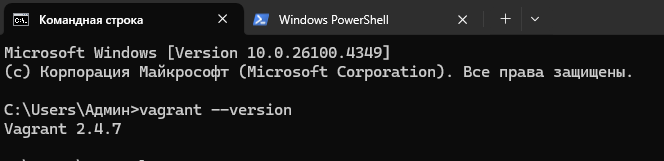

2) Зайди через консоль внутрь виртуальной машины и удостоверься, что исходный код встал, куда нужно. Останови и уничтожь виртуальную машину.

Перехожу в директорию src проекта и ввожу команду `vagrant init`. Команда используется для инициализации нового проекта Vagrant в текущей папке. Она создаёт файл Vagrantfile — конфигурационный файл, в котором описываются настройки виртуальной машины.

- 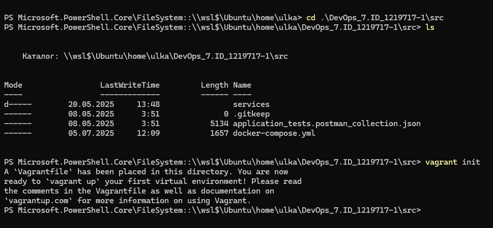

Призапуске запуске команды `vagrant init` создается простейший конфигурационный vagrantfile.

- 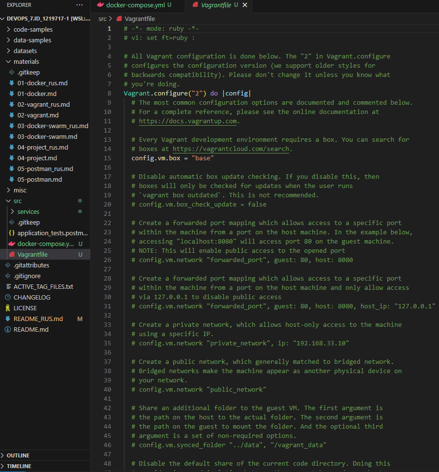
  
Подниваю виртуальную машину командой: `vagrant up` (vagrant работает через VirtualBox)

- 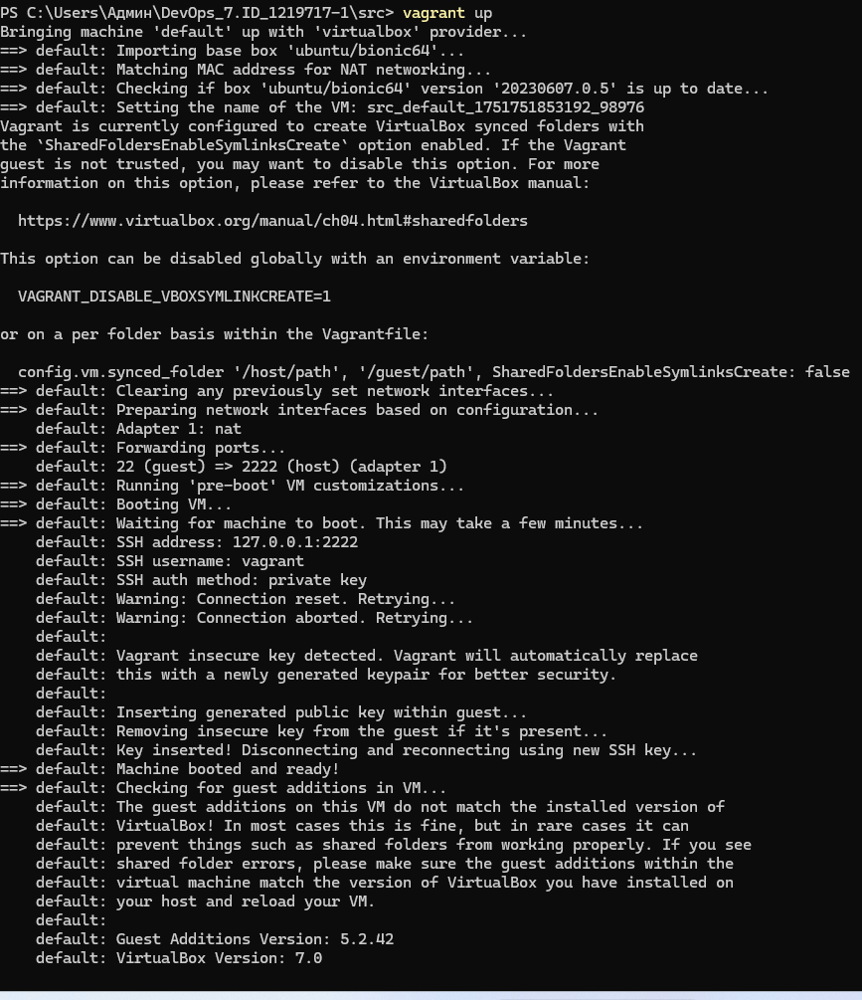
- 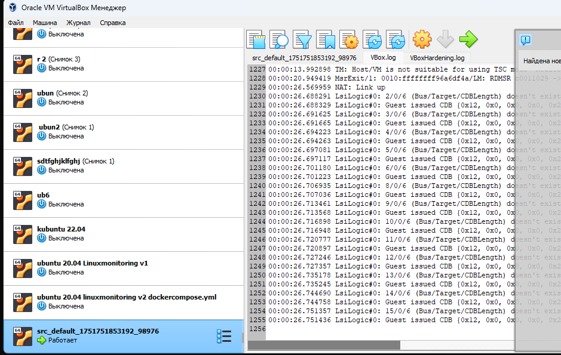
  
Захожу на вирт. машину через ssh: `vagrant ssh`

- 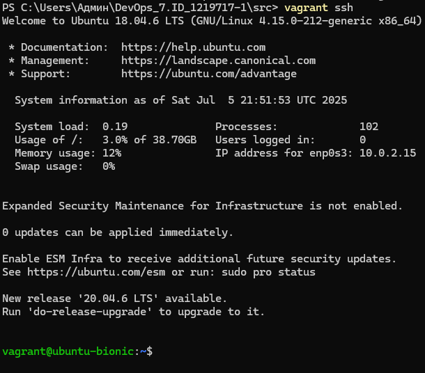

 Проверяю, что директория с кодом перенеслась на вирт. машину:

- 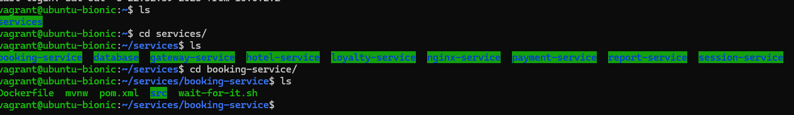
  
Останавливаю и уничтожаю виртуальную машину:

- 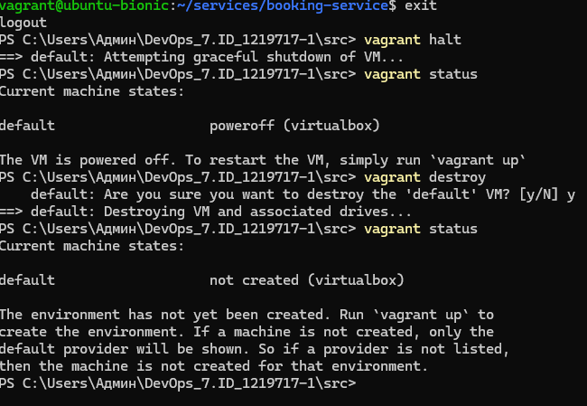

## Part 3. Создание простейшего docker swarm
**== Задание ==**

1) Модифицируй Vagrantfile для создания трех машин: manager01, worker01, worker02. Напиши shell-скрипты для установки docker внутрь машин, инициализации и подключения к docker swarm. Помощь с docker swarm ты найдешь в материалах.
   
Модифицирую Vagrantfile для создания трех машин manager01, worker01, worker02.

- 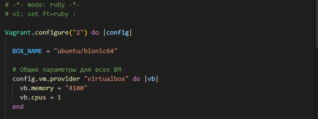
- 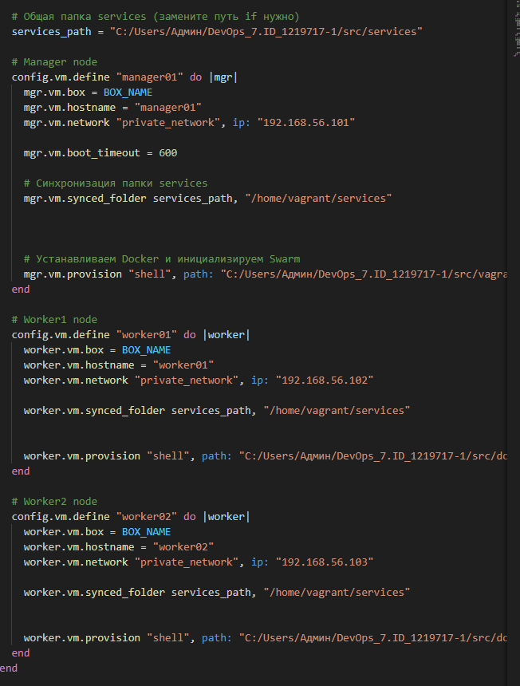  
  
Написала bash-скрипты для manager01:

- 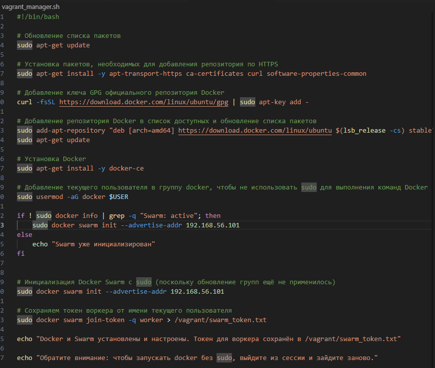

Для worker01, worker02:
  
- 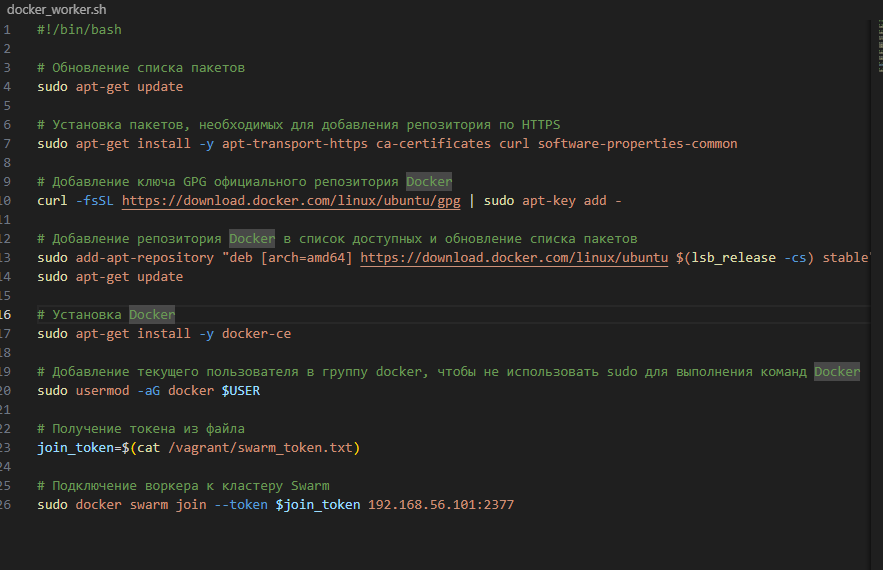
  
2) Загрузи собранные образы на docker hub и модифицировать docker-compose файл для подгрузки расположенных на docker hub образов.

Вхожу в Docker Hub через терминал: `docker login`
 
- 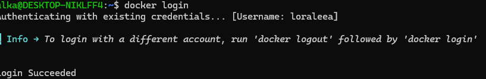

Тегирую локальные образы для Docker Hub: `docker tag myapp:latest username/myapp:latest`

- 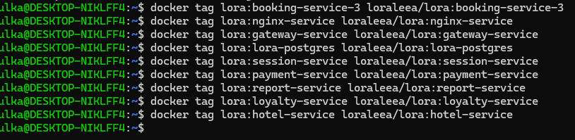

Загружаю (push) образы на Docker Hub:  `docker push username/myapp:latest`

- 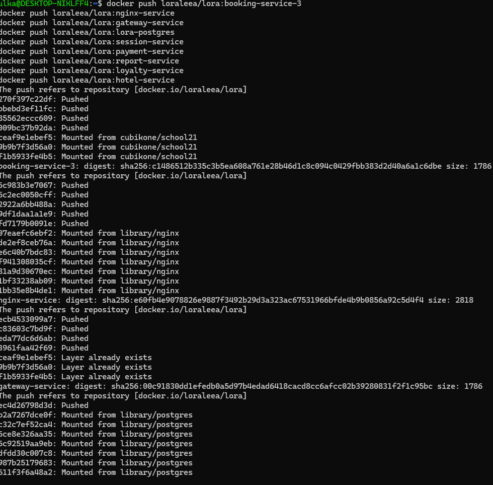

3) Подними виртуальные машины и перенести на менеджер docker-compose файл. Запусти стек сервисов, используя написанный docker-compose файл.

Перенашу измененный docker-compose.yml:

- 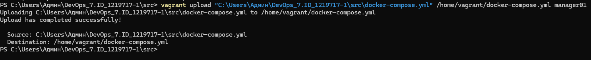
  
- 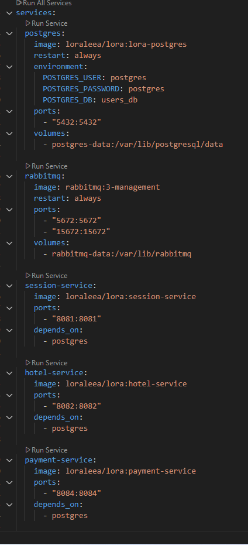
   
Перед звпуском машины, я забыла ввести команду `docker pull`, но в данной ситуации это не критично. Так как при тегировании и загрузке образов на Github, название и тег я меняла. Измененные названия образов прописада в модифицированный docker-compose.yml. То есть при запуске команды `sudo docker stask deploy -c docker-compose.yml Mydeploy` образы, прописанные в новом docker-compose.yml подгрузились с Github автоматически.

- 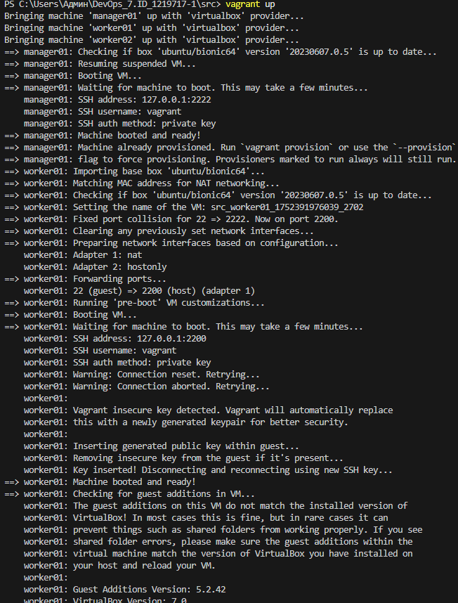

- 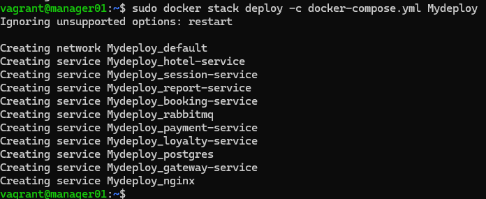

После создания стека проверяю статус:

- 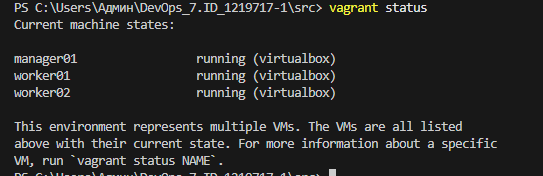

4) Настрой прокси на базе nginx для доступа к gateway service и session service по оверлейной сети. Сами gateway service и session service сделай недоступными напрямую.
   Создала дополнительный сервис Nginx с конфигурационными файлами обратного проксирования.

- 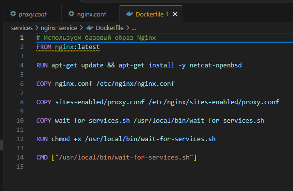

- 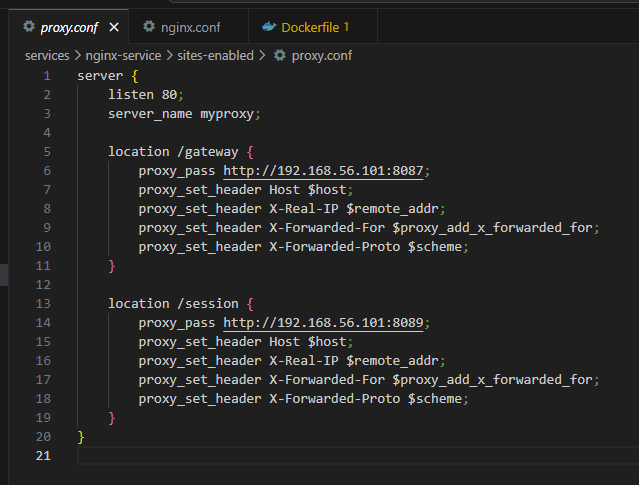

- Nginx слушает порт 80 и маршрутизирует запросы. Запросы с путём, начинающимся на /gateway, идут на сервис, работающий на порту 8087 по адресу 192.168.56.101. Запросы с путём, начинающимся на /session, идут на сервис на порту 8089 того же хоста.
Конфигурационный файл Nginx с блоком server, который реализует проксирование (reverse proxy) запросов к двум внутренним сервисам. 
`server` Определяет виртуальный сервер Nginx, который слушает HTTP-запросы. `listen 80` сервер слушает входящие соединения на 80 порту (стандартный порт HTTP). `servername myproxy` имя сервера (домен или хост), для которого применяется этот конфиг. В данном 
`location /gateway`- все запросы, начинающиеся с `/gateway`, будут проксироваться на внутренний адрес `http://192.168.56.101:8087`.
`proxypass http://192.168.56.101:8087`- проксирование запроса на указанный адрес.

- 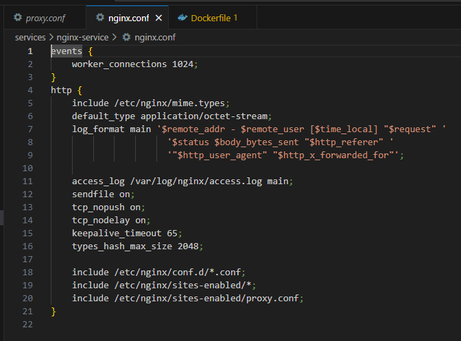

1. Конфигурационный файл Nginx который необходим для управления обработкой сетевых соединений. Блок events это производительность и число подключений. Worker_connections 1024— задаёт максимальное количество одновременных подключений, которые один рабочий процесс (`worker process`) может обрабатывать одновременно. При 1 рабочем процессе и 1024 соединениях можно обслуживать до 1024 клиентов одновременно, численность рабочих процессов умножается на количество подключений .

2. Файл настроен для обслуживания HTTP-запросов, ведёт логи с подробной информацией, обеспечивает сетевые оптимизации для быстродействия.
3. Подключает сторонние конфигурационные файлы для расширения функциональности (виртуальные хосты, прокси).
- `include /etc/nginx/mime.types;`— подключает файл с описанием соответствия расширений файлов и MIME-типов (например, `.html` → `text/html`), чтобы сервер мог отсылать корректный заголовок Content-Type.
- `default_type application/octet-stream;`— если MIME-тип не найден, используется данный тип по умолчанию (общий бинарный поток данных).
- `log_format main '...'`— создаёт пользовательский формат логов под именем `main`.
 В логи записывается:  
  — IP клиента (`$remote_addr`)  
  — имя пользователя, если есть (`$remote_user`)  
  — локальное время запроса (`$time_local`)  
  — строка запроса (`$request`)  
  — HTTP-статус ответа (`$status`)  
  — количество отправленных байт тела ответа (`$body_bytes_sent`)  
  — адрес страницы, с которой пришли (`$http_referer`)  
  — User-Agent клиента (`$http_user_agent`)  
  — заголовок X-Forwarded-For, если присутствует (`$http_x_forwarded_for`), часто используется для определения IP клиента за proxy.

- `access_log /var/log/nginx/access.log main;`— включает ведение журнала доступа в файл `/var/log/nginx/access.log` с использованием формата `main`.

- `sendfile on;` — включает использование системного вызова `sendfile()` для более эффективной передачи файлов (минимизация копирования данных между ядром и пользователем).

`tcp_nopush on;`— оптимизация TCP, уменьшает число пакетов при отправке файлов, минимизирует задержки.

- `tcp_nodelay on;`— отключает алгоритм Нейгла, позволяет отправлять пакеты без задержек, важно для интерактивных приложений.

- `keepalive_timeout 65;`— время (в секундах), в течение которого соединение остаётся открытым для повторных запросов (позволяет клиенту отправлять сразу несколько запросов по одному TCP-соединению).

- `types_hash_max_size 2048;`— максимальный размер хэш-таблицы для хранения MIME-типов, повышает производительность поиска типа по расширению.

- `include /etc/nginx/conf.d/*.conf;`— подключает дополнительные конфигурационные файлы из каталога `conf.d`. Используется для сегментирования настроек.

- `include /etc/nginx/sites-enabled/*;`  — подключение конфигураций виртуальных хостов (сайтов), которые активированы (обычно через ссылку из sites-available).

- `include /etc/nginx/sites-enabled/proxy.conf;`— явно подключается дополнительный конфиг `proxy.conf` из той же папки. Возможно, там описаны правила обратного прокси или маршрутизация.

5) Прогони заготовленные тесты через postman и удостоверься, что все они проходят успешно. В отчете отобрази результаты тестирования.
   
- 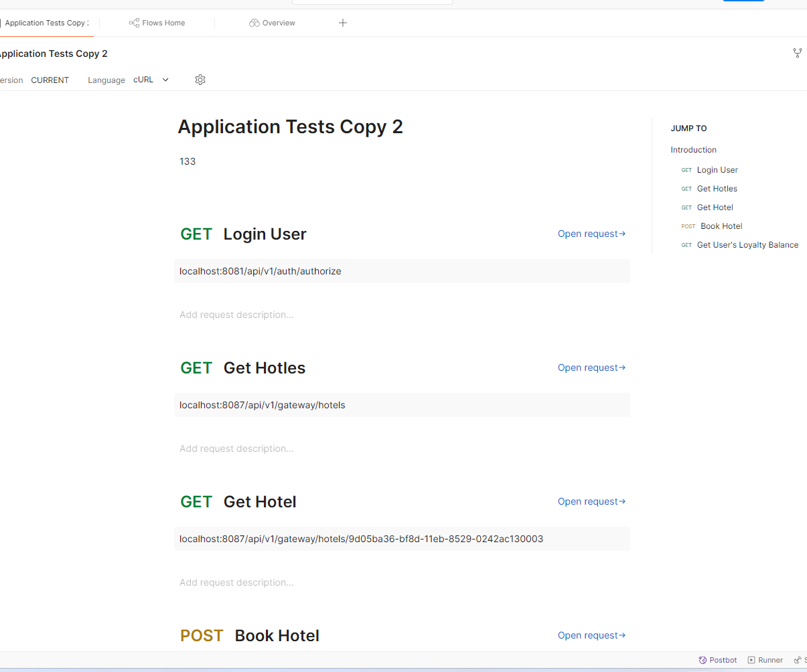

6) Используя команды docker, отобрази в отчете распределение контейнеров по узлам.

Команда `docker node ls` показывает список узлов с их статусом и ролью.
- 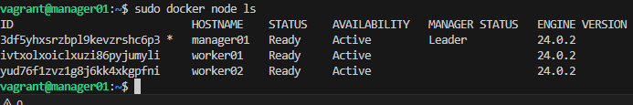

- 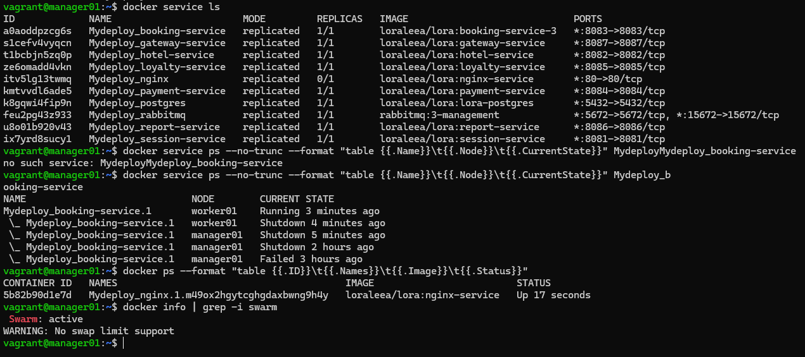
Командой `docker service ls` узнаю имена сервисов.
Команда `docker service ps --no-trunc --format "table {{.Name}}\t{{.Name}}\t{{.CurrentState}}" Mydeploy_booking-service`
Командой `docker ps --format "table {{.ID}}\t{{.Names}}\t{{Image}}\t{{.Status}}"` для просмотра всех контейнеров на узле (без swarm)/.
Командой `docker info | grep -i swarm` проверяю что развернуто: простой Docker или Swarm.    

7) Установи отдельным стеком Portainer внутри кластера. В отчете отобрази визуализацию распределения задач по узлам с помощью Portainer.
Создаю файл portainer-stack.yml. Сервис Portainer будет запущен на узле менеджер, открываться на порту 9000, для доступа к веб-интерфейсу.

Командой `docker deploy -c portainer-stack.yml portainer` развернула стек в кластере Swarm.

- 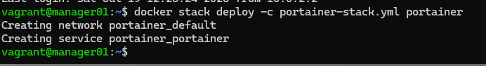

Командой `docker stack services portainer` проверяю что сервис запущен.

- 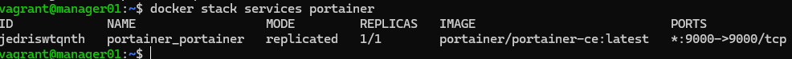

Захожу в браузере по адресу http://ip менеджера:9000.

- 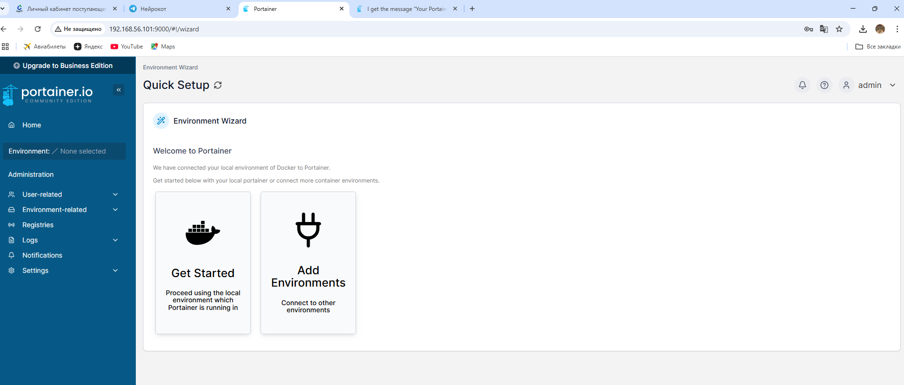

- 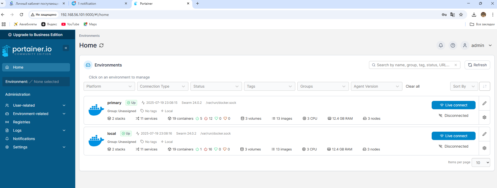

- 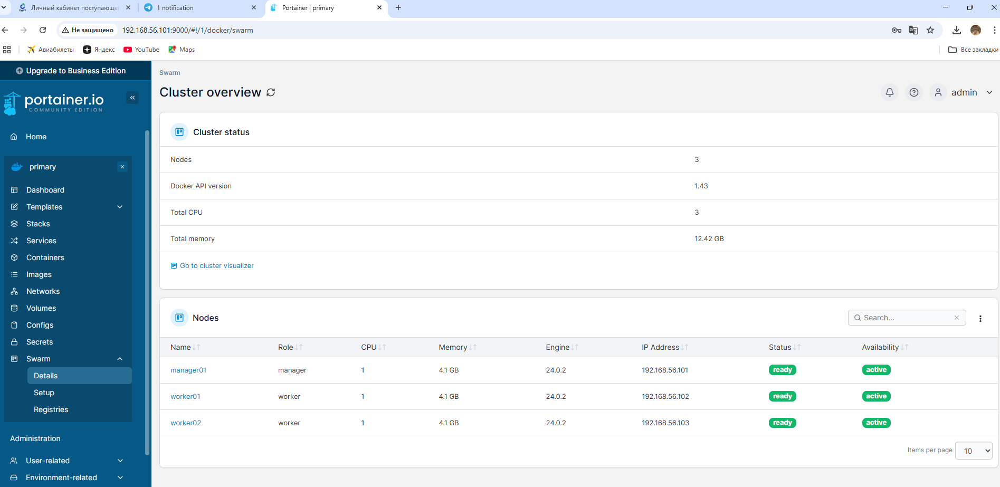

